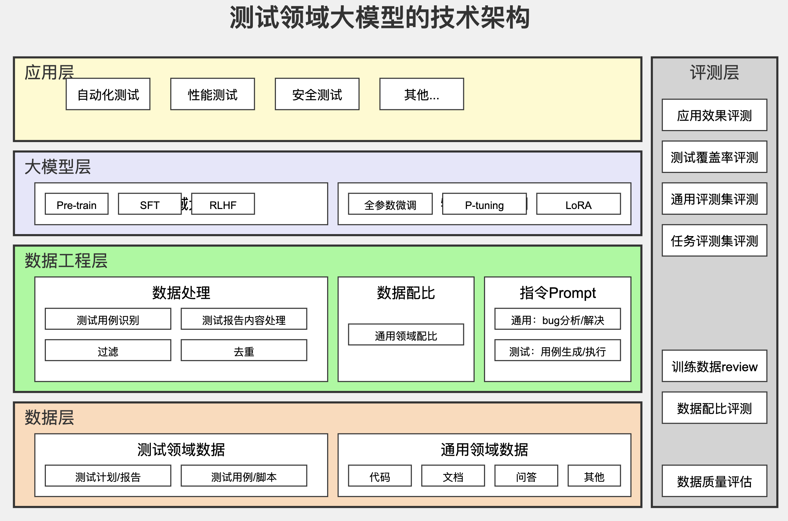
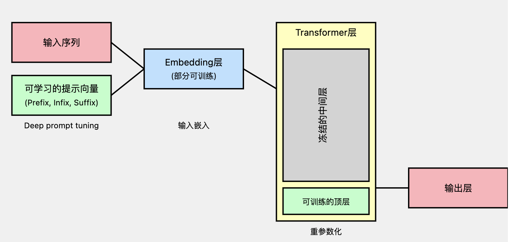

# Cyberbard BP

## Executive Summary

### Fast Facts

Project Name: Cyberbard

- Company Name: Cyberbard LTD

- Company Number: 15879685

- Incorporated on: 07/08/2024

- Target Audience: Small and medium software development teams

- Headquarters: London, UK

- Market Size: £*** billion

- Website: [www.cyberbard.co.uk](https://www.cyberbard.co.uk)

### Quick Description

<!-- Cyberbard是一家位于伦敦的AI初创企业。我们设计了一种先进的AI测试技术，可以模仿真实测试人员的意图和操作，让广大测试资源不足的中小软件公司通过我们的平台，自动化完成软件的功能测试。 -->

<!-- 将传统测试中最消耗精力的且研发，这个想法也源自于自己之前所在公司的测试需求。由于团队规模限制，我们每5个开发人员才能配备1个测试，导致测试的压力非常大。单元测试部分由开发人员处理，但是功能测试主要依靠测试人员来完成。我们的系统每两周要发一个新的版本，上线前需要对主要的功能和新增功能进行测试。而这部分只能通过测试人员手工操作处理，编写测试用例，反复操作每一个功能，反馈测试报告。上线新功能较多的时候，大量重复劳动让测试人员难以应对。 -->

后来团队引进了第三方公司的自动化测试系统，让流程具有了一定的自动化能力，只需要测试人员编写好操作脚本，就可以自动化运行。但是，测试人员反馈脚本并不好编写，或者需要进行专门的学习，或者使用特殊工具录制。一方面对测试人员的要求较高，一方面产品有变化的时候，旧的脚本也需要修改和维护。时间长了以后，大家发现，维护脚本的成本过高，有时候还不如人工手动测试。最后这些自动化工具只是辅助性使用，大部份功能测试的工作还是人工来完成。

团队曾今想自研一款能够完全代替测试人员来测试软件功能的产品，但是基于之前的技术栈，还无法在只输入软件的页面和一些基本信息的情况下，自动推导出完整的测试用例，也就是无法知道需要测试什么内容。所以这个想法就搁置起来了。

但是现在，随着大语言模型（LLM）的发展，多模态技术的成熟，更加精确的测试用例推导变得不是不可能。通过初步的测试和可行性验证，我们推出的LLM-Test平台，可以代替测试人员，全自动的完成“功能测试”的全部工作。只需要自然语言描述的软件功能，无需源代码，就可以遍历所有界面，根据软件界面的内容自动生成“测试用例”，并且自动运行测试用例，最后直接反馈完整的测试报告给测试人员。

不同于市面上已经有的其他产品，测试人员不需要自己录制操作路径，也不用手动编写脚本，本产品通过自研的测试领域专用大语言模型，可以软件界面上的文字内容，识别下一步操作的的路径，自动生成所有可能的测试用例并开始测试。测试人员只需要核对检查结果即可，极大提高整个产品的质量和迭代效率。

未来随着数据的积累，LLM-Test平台不但可以自动化完成功能测试，还可以进一步为整个软件的产品设计，交互流程提出优化意见，赋能整个软件的功能开发周期。

目前我们已经完成了市场调研和初步验证，即将进入开发阶段。我们在潜在消费者中得到了极大关注，已经有10家公司发来了预定合同，1000多个测试团队负责人关注了我们的官方账号。

### Vision statement

<!-- _(Where do you want to be in five years time?)_ -->

### Mission statement

<!-- _(What are you offering, who to and how?)_ -->

### What is your Unique Selling Proposition?

<!-- _(Very important! USP is the key point that shows your business is superior to others. It is also a very important foundation for reflecting innovation, feasibility and other aspects in the business plan.)_ -->

无需代码，全自动生成UI测试用例。

### What are you going to do in the first year?

<!-- _(This part will form the main part of your BP, including R&D, Marketing & Sales, Team structure)_ -->

### What are you going to do in the following two years?

<!-- _(This part will be the part of research and development roadmap, as well as will form the basis of your team plan and finical forcast for 3 years period.)_ -->

## Team Overview

- **Heng Tian | Founder**
Heng作为公司的创始人，获得了北京大学工程管理硕士，有超过10年的带领团队开发和测试新产品的经验，职业生涯历经多个不同类型的软件公司，了解初创型和上市公司的软件开发和测试流程，知道其中的痛点，一直在寻找使用新的技术来改变行业规则的机会。

## Product/Service

### What products/services are you offering?

<!-- _(Provide as much detail as possible)_ -->

近年来，应用程序已经成为我们日常生活中不可或缺的一部分，有数以百万计的应用程序可以通过手机浏览器或者电脑的浏览器，比方使用Microsoft Edge、Chrome、Safari等软件直接访问和使用。随着应用程序在我们日常生活中的重要性日益增加，对于应用程序开发者来说，确保他们的应用程序具有高质量并且对用户来说按预期执行变得越来越重要。

测试可以划分为3种，单元测试，整合测试和功能测试。前面两种和开发人员关系比较密切，已经有一些工具来降低成本。但是功能测试依然需要大量的人力工作。功能测试的主要有以下任务：

- 测试人员通过理解产品的设计和功能，编写测试用例。
- 每次新功能完成后或者发布新版本前，测试人员在图形用户界面上执行全部的测试用例。
- 测试人员记录下测试用例的通过情况，反馈出现问题的用例的操作路径给开发人员修改，并且验证修改结果。

举一个例子：比方产品为一个购物网站新增加了一个功能，之前添加购物车的时候不能选择数量，现在多了一个输入框可以选择数量。传统的流程下，测试人员首先需要理解产品需求，手动为这个新功能编写测试用例。
这个测试人员可能会增加下以下三条测试用例：

- 点击“数量”输入框，输入“ABC”，点击“添加购物车”按钮，系统应该提示“只能使用数字作为商品单位”。
- 点击“数量”输入框，输入“0”，点击“添加购物车”按钮，系统应该提示“至少购买1个商品”。
- 不点击“数量”输入框，直接点击“添加购物车”按钮，系统应该默认购买1个商品。
  
可见，测试人员的工作量随之增加了，不但要测试这三条新的用例，之前的相关功能也需要回归测试一次，保证没有影响到其他的功能。可以看到，这个过程非常消耗人和物力，而且基本上靠人工来编写测试用例，对测试人员的要求很高，而且很容易出现测试用例无法覆盖全面的情况，这意味着可能会错过重要的错误和问题。

如果使用LLM-Test平台，测试人员只需要了解这次新增了“输入数量”的功能，然后使用自然语言“添加购物车新增了输入商品数量功能”告诉平台，平台就可以开始工作了。

- 首先，平台会重新扫描页面，找到变化的页面元素，比方新增加的“数量”输入框，将它们作为新的信息和基础信息结合起来。
- 就会通过“测试领域专用大语言模型”的推导，自动运算出全部需要新增的测试用例。可能还会补充更多的测试人员可能漏掉的测试用例。
- 一切推导完成以后，开始在虚拟环境中，自动操作软件界面，执行测试用例，并将测试结果发送给测试人员。

从这个例子可以看出来，LLM-Test平台可以在功能测试层面完全做到全流程自动化，基本上可以代替大部分人力的工作，而且测试用的覆盖率可能比传统人工方式更高。整个平台为了自动化的完成任务，使用了很多新的技术和方法，比方识别软件的界面上的文字需要用到Optical Character Recognition（OCR）技术，自动化操纵软件运行测试用例，需要用到Robotic process automation（RPA）技术。但是，最核心最重要的能力，就是需要完成“测试用例”的推导。目前很少有团队在这方面有研究，而这也是本产品的创新点。在后面的章节会详细讲述我们是如何构思的，以及用哪些方面来突破现有技术的限制，实现类似人类的“测试用例”推理能力。

#### 发展方向

介绍一些具体场景，展示大模型在实际测试中的应用和价值。

#### 提升测试效率

通过自动化测试和智能分析，显著提升测试效率。减少人工干预，提高测试的速度和准确性。

#### 优化UI/UE操作体验

通过智能化建议和优化，改善用户界面和用户体验。确保测试过程中的操作更直观、更高效。

### Innovation

_(Provide as much detail as possible about the innovation aspects of your products/services)_

#### 背景介绍

为了让功能测试自动化，首先需要解决的就是能够自动决定需要测试什么内容，以及判断某一个功能是否测试完成，返回成功和失败的结果。在传统的做法中，这些步骤都需要测试人员手动制定。随着技术的发展，人们研发出了很多新的方式来降低每一个环节的成本。目前业内已经开始使用深度学习（DL）和强化学习（RL）技术进行自动化测试。通过学习人类测试员的行为，这些方法旨在生成类似人类的操作和交互，以更全面和有效地测试应用程序的功能。这些方法基于这样一个观点：测试算法执行的操作越接近人类用户的操作，测试就会越全面和有效。尽管如此，基于DL或RL的功能测试方法仍存在一些限制。

- 训练算法需要大量的数据，而这些数据很难从现实世界用户交互中收集。这是因为现代应用程序程序的复杂和动态特性，它们可能有数十甚至数百个不同的页面，每个页面都有其自己独特的交互集和可能的用户行为及逻辑。此外，这些方法生成的测试输入与真实用户交互痕迹显著不同，导致测试覆盖率低。
- 训练算法被设计为从训练数据中学习并进行预测，所以它们可能无法很好地泛化到新的、未见过的情况，因为应用程序在不断演变和更新。
- 应用程序可能是非确定性的，这意味着每次执行动作的结果可能不总是相同的（例如，从具有最后一个内容的列表中点击“删除”按钮将产生一个空列表，此时删除按钮不再工作），这使得RL算法特别难以学习和做出准确的预测。

因此，迫切需要另一种更有效的方法来生成类似人类的操作，以全面测试种类繁多的应用程序。大型语言模型（LLMs），如GPT-3/4，已成为自然语言理解和问答的强大工具。LLM在这些模型的最新进展激发了各种研究，这些研究检查了这些模型在软件开发任务中的使用。OpenAI的ChatGPT（通过聊天交互的生成式预训练变换器）拥有数十亿个参数，并且经过了大量数据集的训练，包括测试脚本和错误报告。其在多个领域和主题上的卓越表现展示了LLM理解人类知识并以知识渊博的专家身份与人类互动的能力。受ChatGPT启发，我们提出了LLM-Test方案，将功能测试问题表述为问题和回答（Q&A）任务，即让LLM扮演人类测试员的角色来测试目标应用程序。然而，在将LLM-Test实现的过程中过程中存在的主要挑战是需要一个擅长推理“测试用例”的专业领域大语言模型。

#### 测试领域大语言模型的必要性

为什么市面上的通用大模型提供基础服务能力后，还需要测试领域大模型的存在？举个例子：飞艇、帆船等是交通工具，但是无法在高速公路行驶，通用大模型好比抽象的交通工具，代表了通用领域能力，不是具象化的交通工具概念。测试领域的私域语料丰富，特别是本产品涉及到的“测试用例”的相关数据，是通用大模型难以涉及全面的。

#### 测试领域大语言模型技术特点

###### 洞察业务

测试领域大模型能够深入理解测试领域的特定业务需求和流程。它们能够通过分析和处理相关数据，为测试提供更具针对性的洞察。

###### 输出准确

专用大模型在测试领域的数据和任务上进行了微调，确保输出结果的高准确性。它们能够更好地处理测试过程中遇到的特殊情况和复杂问题。

###### 快速进化

软件的功能千变万化，用户也会不停地产生新的数据，需要不断的训练新的模型以便适应新的设计。领域大模型能够随着测试领域的发展和变化快速调整和优化。通过不断的学习和改进，它们可以保持高效和前沿的性能。

#### Technology Architecture

##### 数据层

包括软件测试领域数据和通用领域数据。它们提供了大模型训练和优化的基础数据支持。

##### 数据工程层

包括数据处理（目标语言识别，文本去重，过滤）、数据配比和指令Prompt。这一层确保数据的高质量和适用性，为大模型的训练提供良好条件。

##### 大模型层

测试领域大模型是测试大模型底层大模型，构建方式：预训练（Pre-training）、监督式微调（SFT）及基于人类反馈的强化学习微调（RLHF）。

针对特殊任务进行微调。包含（P-turning v2，LoRA）
它在底层模型的基础上，结合测试领域的具体需求进行优化和增强。

##### 评测层

每一层有对应的评测要求，数据层主要是针对数据质量的评估，数据工程层中则是针对数据配比和训练数据进行评估，大模型层包括测试领域和通用测评集，也会自建测评集。应用效果的测评是需要厘清业务收益和业务效果。通过全面的评测，确保大模型在实际应用中的有效性和可靠性。

###### 评测类型

包括主观题和客观题。主观题可以考察模型的理解和推理能力，客观题则侧重于模型的准确性和客观数据处理能力。

###### 测评难度

测评内容难度分为初级测试、中级测试、高级测试。不同难度的测评内容能够全面考察模型在各个层次的表现。

###### 测评方式

包括人工测评、自动化测评、更大规模参数大模型辅助测评。

###### 测评范围

包括通用领域、垂直领域以及专业任务领域。通过多维度的评测，确保大模型的全面性和适用性。

##### 技术流程

领域大模型构建的技术流程主要分为三部分，各部分紧密结合，确保大模型的有效构建和应用。

##### 模型构建

构建过程包括数据准备、模型训练和调优。需要针对测试领域进行定制化调整，以满足行业需求。

#### Three years roadmap

_(Should match the hiring plan -- Team Plan)_

#### Potential Patent Direction

_(This is a vital part of a business plan at the moment, because endorsement bodies(EB) and Home Office(HO) now attach great importance to whether there is hard-core technology in the business plan.When looking for potential patent application directions, you should fully refer to the IPO's definition of patents and application conditions, especially in the software direction. It is best to have a professional patent lawyer participate in the consultation and judgment.)_

专利方向：自动生成测试用例的大模型模型的搭建方法。

##### 目前测试用例生成方法

在软件测试领域中，测试用例通常由测试工程师根据需求文档设计，并经过团队评审和改进。设计测试用例需要理解软件需求、掌握测试设计技术，并使用测试管理工具记录和管理测试用例。测试工程师通过需求分析、测试计划、测试设计、评审和执行等步骤，确保测试用例覆盖全面，能够有效验证软件的功能和性能。

##### 一种新的生成测试用例的方法

我们使用特殊设计的测试用例数据，对基础大模型进行微调，形成新的测试领域大模型，可以全自动的产生测试用例，并且可以自动将测试用例转化为其他测试系统可以理解的格式，自动进行测试。这里简述一下基本的的技术特征和验证方法。

###### 数据集准备

微调的效果的好坏，主要在于输入参数的质量的高低。目前并没有专门针对功能测试进行微调的大模型，为了更好的微调效果，我们设计了一种结构，将软件界面的元素和操作映射成多轮对话的形式，形成训练数据、验证数据和测试数据。目前数据来源与自己生成的测试用例和网上公开的测试用例数据。

这个数据集应该包含:

- 软件界面描述:包括界面上的文字、按钮、输入框等控件的详细信息。
- 对应的高质量测试用例:由专业测试人员编写的完整测试用例。
- 对应的高质量测试用例:由专业测试人员编写的完整测试用例。

数据集的格式可以是:
输入: [软件界面描述]
输出: [对应的测试用例]

为了获得足够多样化的数据,我们应该收集不同类型软件的界面和测试用例,如Web应用、移动应用、桌面软件等。理想情况下,数据集应该包含至少千万个这样的样本对。

###### 模型监督微调

接下来,我们将使用P-Tuning v2方法对预训练的大语言模型进行微调。P-Tuning v2是一种参数高效的微调方法,它只更新模型中的一小部分参数,从而减少计算资源的需求。

这个原理图展示了P-tuning v2微调方案的主要组成部分和数据流向。让我详细解释一下图中的各个部分:

输入层: 这是模型接收原始文本输入的地方。
可学习的提示向量: 这是P-tuning v2的核心。我们在输入层后添加了一些可学习的连续向量,它们会在训练过程中不断优化,以捕捉特定领域的知识。
Embedding层: 这一层将输入的文本和提示向量转换为稠密的向量表示。在这个方案中,Embedding层的部分参数是可以优化的。
冻结的Transformer层: 这是原始预训练模型的主体部分,包含了多个Transformer层。在微调过程中,这些层的参数被冻结,不参与训练,以保持模型的通用能力并防止过拟合。
可训练的顶层: 模型的最后几层是可以训练的。这些层可以帮助模型更好地适应特定任务。
输出层: 这一层产生最终的预测或生成结果。

在这个方案中,我们主要调整了以下"层"和"参数":

提示向量层: 这是新增的一层,包含了若干可学习的连续向量。这些向量的参数会在训练过程中不断更新。
Embedding层: 部分参数可以微调,以更好地适应特定领域的词汇和表达。
Transformer顶层: 最后几个Transformer层的参数是可训练的,可以根据特定任务进行调整。
输出层: 这一层的参数也是可以训练的,以适应特定任务的输出需求。

参数调整方式:

对于可学习的参数,我们使用梯度下降算法进行优化。具体来说,可以使用诸如Adam或AdamW这样的优化器。
学习率设置: 对于新增的提示向量,我们可以使用相对较大的学习率,因为它们是从头开始学习的。对于模型原有的可训练参数,我们使用较小的学习率,以防止过度偏离原始模型的能力。
正则化: 为了防止过拟合,我们可以在可训练参数上应用L2正则化。

这个方案的优点是:

数据效率高,适合专业数据较少的情况。
计算资源需求较低,因为只有少量参数需要更新。
保持了原始模型的大部分能力,同时又能快速适应特定任务。
具体步骤如下:

- 选择基础模型:可以使用如GPT-3、BERT等预训练模型作为起点。
- 准备提示模板:设计一个固定的提示模板,如"根据以下软件界面描述生成测试用例: [界面描述]"。
- 添加可训练的连续提示词:在模板中插入一些特殊标记,这些标记会被映射到可训练的嵌入向量。
- 训练过程:使用准备好的数据集,通过梯度下降等优化算法来更新这些连续提示词的嵌入,同时保持原始模型参数不变。

###### 奖励模型训练

为了进一步提高生成测试用例的质量,我们可以训练一个奖励模型来评估生成的测试用例。这个过程包括:

- 收集人工评分数据:让测试专家对一部分生成的测试用例进行评分,评分标准可以包括覆盖率、可执行性、有效性等。
- 训练奖励模型:使用收集到的评分数据,训练一个模型来预测测试用例的质量分数。
- 强化学习微调:使用训练好的奖励模型来指导主模型的进一步优化,鼓励生成高质量的测试用例。

###### 评测方案

为了评估模型的性能,我们可以设计以下评测方案:

- 自动化指标:

BLEU分数:比较生成的测试用例与人工编写的测试用例的相似度。
覆盖率分析:评估生成的测试用例对软件功能的覆盖程度。
语法正确性:检查生成的测试用例在语法上是否正确。

- 人工评估:

可执行性:测试人员尝试执行生成的测试用例,评估其可执行性。
有效性:评估测试用例是否能发现潜在的软件缺陷。
创新性:评估模型是否能生成一些人类测试人员可能忽略的测试场景。

- 实际应用测试:

在真实的软件测试项目中使用该模型,比较使用模型前后的测试效率和缺陷发现率。

## Market Research

_(Please describe the size of your industry and market by market share, revenue and number of providers, if it has been established. If you are not sure of this, please highlight what market share you hope to achieve annually over the next 3 years.)_

### 全球自动化测试市场规模预测

2023年软件测试市场规模为518亿美元，预计在2024年至2032年期间，该市场的复合年增长率将超过 7%，这得益于大型公司不断推出新产品和进行创新。随着技术的快速发展、公司不断面临压力，需要提供卓越的软件解决方案来满足用户不断变化的需求。对无错误软件的需求不断增长，刺激了对先进测试工具和技术的市场需求。应用测试自动化市场规模预计到2032年底将超过973亿美元.

软件测试市场呈现出多种区域视角，不同地理区域的需求、采用和增长程度不同。北美包括美国和加拿大，在全球测试软件市场占有较大的份额。该地区受益于成熟的 IT 行业、最新的技术进步以及不同行业对高质量保证服务的巨大需求，包括 IT 和电信、BFSI 医疗保健以及零售业。北美是软件测试市场最大的市场，占全球市场价值的37%。软件测试市场正日益转向持续测试，即将测试无缝集成到开发过程中，以确保更快、更可靠的软件交付。自动化是另一个主要趋势，人工智能和机器学习越来越多地用于智能测试自动化，从而可以高效地测试复杂且不断发展的应用程序。

[Software Testing Market Size - By Component (Application, Services), By Type (System Integrator, Pureplay Software Testing), By Industry (Mobile, Web-based), By Business Type (B2B, B2C), By Application & Forecast, 2024 - 2032](https://www.gminsights.com/industry-analysis/software-testing-market?gclid=CjwKCAjwkJm0BhBxEiwAwT1AXOsk2t1lewMfdIyBMWFOpobDA_tgoqgey7E0PzmvEFXpb29w0ipXwBoC8vYQAvD_BwE)

相关研究报告

[Global Market Size Forecast (2023-2031): www.researchnester.com](https://www.researchnester.com/reports/app-test-automation-market/5105)

### 软件行业中小企业占比

综合来看，全球软件行业整体发展状况良好。在疫情影响下，部分国家及区域受影响较大，新兴经济体展现出了惊人的活力，对全球软件行业的发展起到了促进作用，全球软件及服务市场中，美国依旧处于霸主地位，投资支出规模遥遥领先。目前，全球软件及服务企业主要以小微企业为主，占比达到了95%，行业集中度相对较低，但从技术角度而言，大公司掌握了核心技术，在部分领域依旧处于垄断地位。

从全球软件及服务企业规模分布情况来看，企业员工少于10人的占比为48.2%;10-99人占比为46.8%，两者之和达到了95.0%。100-500人的软件及服务企业数量占比仅为4.4%;员工数量在500人以上的软件及服务企业数量占比仅为0.7%。

小微企业数量占比达95%.

[China Software Industry(2024-2029) Report of Market Prospective and Investment Strategy Planning on](https://bg.qianzhan.com/report/detail/4a047030ec144047.html)

### 不同规模企业测试资源情况

根据statista的一份报告，25.60%的小企业的测试人员占比少于10%，26.2%的小企业的测试预算占比少于10%。

相对于大企业，占据绝大多数的小企业，由于比较缺乏资源，无法配备足够的测试人员。而现有的自动化测试工具过于庞大复杂，价格也非常昂贵。

 **根据一下数据可知，很多中小团队可能无力使用自动化测试工具，还停留在手动测试阶段**

[Future of QualityAssurance: www.statista.com](https://www.lambdatest.com/future-of-quality-assurance-survey)

### 软件行业对测试工具的要求

如下图所示，2013-2018年，整个软件行业的测试的资金要求（最顶部）越来越高。此报告中，超过一半的受访者认为软件测试成本是最大的挑战。这表明组织需要一些智能解决方案来帮助他们降低软件测试成本，同时又不损害软件质量。

同时，大家对“测试中不准确的设置造成的损失”的担忧（图中第二组）也在升高。

[Challenges with IT test environment provisioning for quality assurance and testing worldwide from 2013 to 2018: www.statista.com](https://www.statista.com/statistics/500687/worldwide-survey-challenges-test-environment-provisioning/)

## Competitors

_(complete this table for the competitors you know of)_

| No. | Competitor | 上市 | 用户 |易用性 | 低代码 |  CI整合 | 价格 |
| --- | ---------- | --- |  ----- |  ------ |  ------ | ------ | ------ |
| 1   | Intertek | Yes  |    大型团队    |   难   |      无  |   无  | 定制化 |
| 2   | eggPlant | Yes  |     大中型    |   难   |      无  |   有  | $9999每团队 |
| 3   | Selenium | No  |     大中型 |   难   |      无  |   有  | Free  |
| 4   | katalon | No  |     中小型 |   中等   |      有  |   有  | $175每人/月  |

### Intertek

[官网](https://www.intertek.com/software/)

base：英国

价格：定制化

面向客户：各种行业用的大型企业

成立时间：1996

上市：已经上市LSE：ITRK

市场占有率：28.86％

Intertek 是业界领先的软件测试提供商，在世界各地设有办事处并拥有专业知识。提供具有竞争力的解决方案，包括针对网站、桌面、联网家庭/汽车和移动设备的全方位软件测试服务，并且坚持使用多种测试技术来满足您的需求，并在产品发布的每一步都让您了解情况。充当您的 QA 团队的延伸，将您的流程和工具无缝整合到自己的测试协议中。
 产品涵盖：

- 应用程序程序测试
- 软件和应用程序质量保证 (SQA) 测试
- 网络安全认证和测试

2000年，公司被查特豪斯资本剥离，2002年在伦敦证券交易所上市。老牌测试企业，涉及范围比较广，有很多传统行业的大客户。

---------

### eggPlant Test Automation Suite

[官网](https://www.keysight.com/us/en/products/software/software-testing/eggplant-test/try-eggplant.html)

base：英国

价格：$9999

面向客户：资金充沛的企业

成立时间：2011

上市：被上市公司收购（NYSE：KEYS）

市场占有率：3.11%

Eggplant 软件测试自动化产品最初由Gresham Computing的子公司 Redstone Software 于 2002 年开始开发和销售。 产品涵盖：

- 自动化、人工智能驱动的功能和可用性测试
- 性能测试
- 机器人流程自动化(RPA)
- 性能监控

2020 年 6 月 25 日，Eggplant 被凯雷集团旗下的Keysight Technologies以 3.3 亿美元收购。
历史比较长的传统测试公司，最近针对AI技术的发展，做了不少改进。

---------

### Selenium

[官网](https://www.selenium.dev/)

base：美国

价格：免费

面向客户：有二次开发能力的企业

成立时间：2004

上市：未上市

市场占有率：28.86％

Selenium 是一个用于 Web 应用程序的可移植软件测试框架。Selenium 提供了一个回放工具，用于编写测试，而无需学习测试脚本语言。
作为免费开源软件，Selenium有广泛的使用者和高达28.86％的市场占有率。
本软件始于 2004 年在芝加哥的 ThoughtWorks，很多公司贡献了代码。
一些知名测试平台基于此软件进行了二次开发，适合有较强开发能力的团队使用。

---------

### katalon

[官网](https://www.selenium.dev/)

base：美国

价格：$175每用户/月

面向客户：敏捷中小型团队

成立时间：2016

上市：未上市

市场占有率：7.33％

Katalon 平台是 Katalon 公司开发的一款自动化测试软件工具。该软件基于开源自动化框架Selenium和Appium构建，具有专门用于Web、API、移动和桌面应用程序测试的IDE界面。 其首次内部发布是在 2015 年 1 月。其首次公开发布是在 2016 年 9 月。Katalon 平台提供了用于创建测试用例的双重可互换界面：针对技术水平较低的用户的手动视图，以及面向经验丰富的测试人员的脚本视图，以便使用语法高亮和智能代码完成功能编写自动化测试。整体来说，界面使用比较简单，为开发人员提供了低代码工具，不用编码也可以编写测试用例。

---------

## Marketing

### Who is your target market?

提高资源不足的小型团队的测试效率，持续保障软件的稳定性。

### What marketing activity do you plan to undertake?

### What do you plan to spend on marketing?

## Operations

### Do you have an office, warehouse or other premises? and if yes, what are the costs associates with this facility?

### What equipment and assets are needed (include all equipment, vehicles, computers, and office equipment). Please include all expected costs

### Please list any facility and equipment changes and its relevant costs expected over the next 3 years

## SWOT Analysis

_(The SWOT for your business)_

### STRENGTHS

### WEAKNESSES

### OPPORTUNITIES

### THREATS

## PESTLE Analysis

_(complete the following analysis for your business)_

### What Political factors will affect your business?

### What Economic factors will affect your business?

### What Socio-Cultural factors will affect your business?

### What Technological factors will affect your business?

### What Legislative factors will affect your business?

### What Environmental factors will affect your business?

## RISK MANAGEMENT

### Please provide details of any risks to the business

## INVESTMENT

### How much are you investing?

_(Please note that the minmal investment budget is £160,000, we strongly advise to ensure that the project has sufficient funding to achieve their plans, including supporting the business during early growth phases;)_

### How will you be spending the investments in the business?

_(3 years finical plan, usually the initial inventment capital will be used in the first 18 months)_

## REVENUE & TURNOVER with assumptions

### What are your average sales prices?

### How many sales do you expect to achieve each month and how will this increase over the first 3 years?

### What is your anticipated income?

    - Year 1

    - Year 2

    - Year 3

### What is your anticipated profit margin after costs?

## EXPENSES

_(Please list all the regular expenses you can think of.)_

### Please provide a breakdown of all the costs associated with manufacturing your product _(if applicable)_
