# Cyberbar 商业计划书

## 1 Business Summary

### 1.1 Introduction

Cyberbard LTD是一家位于 London 的AI初创企业。我们的产品“Cyberbard”通过设计和训练一种先进的测试领域专用AI大模型（LLM），可以模仿真实测试人员的意图和操作，让广大测试资源不足的中小软件公司通过我们的平台，自动化完成“功能测试”的全部步骤，降低测试成本，加快新产品上线速度。

### 1.2 What’s the current market problem?

<!-- 介绍发现的市场痛点。1-2个即可，不要写超过3个。 -->
“功能测试”是软件研发中非常重要的一环。具体来说，“功能测试”是对软件整体的界面，交互进行的测试，需要多个经验丰富的测试人员才能完成，工作包括分析新增功能，编写测试用例，反复运行这些用例找到产品的问题，写测试报告反馈整个功能的最终可用性给开发人员。
具体如下图所示：

这里面的每一步都非常繁琐耗时，实际操作的时候非常有可能出现疏漏。而为了抓住市场机会，软件产品的迭代速度往往非常之快，而很多中小软件企业主要资源用在新产品的开发上，往往没有足够的测试人员来配合新功能的测试。最后的结果就是，部分中小型公司为了保障产品上线速度，只能忽视“功能测试”的重要性，让其他人员兼职测试，简化甚至省略一些步骤，造成产品质量的下降。

如果是大型的团队，可以有足够的资源配备大量的人力来测试，或者将整个测试工作外包给第三方来完成。但是对于广大中小团队，还需要更好的解决方法。如果有一种工具可以让“功能测试”尽可能的自动化低成本完成，将会对中小型团队非常有吸引力。

### 1.3 Our solution and USP

<!-- 针对上面发现的痛点提出解决方案以及你的独家卖点（USP） -->
虽然市面上已经有一些测试工具来实现一定的自动化“功能测试”能力，但是整体来看依然有很大的改进空间。

最常见的解决方案是让测试人员编写某种测试脚本。测试工具通过读取这些脚本可以控制界面的操作。然后，测试工具反复的自动运行这些脚本来进行“功能检测”。但是这样会让脚本的编写成为了一个瓶颈。要求测试人员编写脚本代码会极大提高测试人员的工作量，而且不同的测试工具还有不同的脚本，这些能力并不通用，花了很大精力培养的测试人员，可能换一个测试工具，就又需要重新学习。随后也出现了一些低代码的测试工具，可以通过“录制”等方式来加快脚本编写，但是依然需要测试人员手动操作一遍才能形成脚本。问题是软件产品变化很快，之前花了很多时间录制的脚本，可能因为一个按钮改动，需要批量修改，往往会造成测试人员没有精力修改以前的脚本。也就是说，如果测试资源不足，脚本很容易过时而被废弃。最后，这些测试工具还可能相当复杂和昂贵，需要配套其他软件项目管理软件才能使用，甚至学习如何使用它们都需要专门的人员培训，一般的中小企业也很难负担。

如何让测试资源不足的中小软件企业也能轻松的做好“功能测试”，最重要的是使用自动化的工具来帮助测试人员自动编写测试用例，生成脚本，并且可以自动维护这写脚本。这样让整个“功能测试”的所有环节都可以实现自动化。

现在 LLM（大语言模型）的技术日新月异，让这个以前是实现起来很困难的问题有了更好的解决方案。 Cyberbard 结合基于创始人多年来和各种规模的产研团队的合作经验，收集了大量测试相关的行业数据，计划训练出一种专门为功能测试人员服务的AI模型，只需要测试人员使用自然语言提供关于本次新增功能的简单描述，我们的平台就可以自动拆分产品细节，编写测试用例，生成测试脚本，然后自动化运行这些脚本。测试人员要做的就是审核这些脚本，然后等待系统最终的测试报告。当产品有改动的时候，我们的AI模型也会自动去修改相关脚本，避免测试人员的重复劳动。

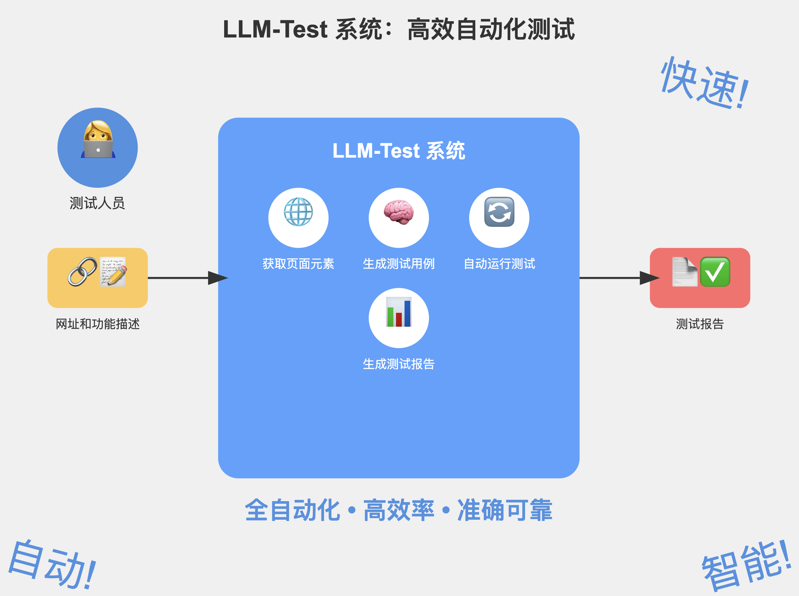

总之， Cyberbard 的USP就是：通过专用的AI模型，将之前最耗时的“编写测试用例”和“生成脚本”的部分进行了自动化，让测试的自动化程度进一步提高。这样的话，测试人力资源的不足和对软件质量的担忧也不再成为中小软件公司发展的障碍。产研团队可以集中力量到新产品的迭代，用更低的成本。

### 1.4 Feasibility Study

<!-- 可行性研究的内容。商业验证的内容在这里体现。 -->
#### 1.4.1 Market Feasibility

根据GMI的预测，未来10年全球软件测试行业依然保持7%的年增长率，应用测试自动化市场规模预计到2032年底将超过973亿美元. 其中小微企业数量占比达95%. 根据statista的一份报告，25.60%的小企业的测试人员占比少于10%，26.2%的小企业的测试预算占比少于10%。说明很多中小软件企业需要新的自动化工具来弥补测试资源不足的问题。

目前 Cyberbard 的官网已经开启了等待列表，网页的访客可以在线填写邮箱获取最新的消息，已经有超过1000位测试人员愿意第一时间尝试我们的产品，我们的官方社交媒体上有超过1000人的关注者，官网的介绍blog超过1万人阅读。同时，还有10家公司和我们签订了首批意向合同。很多潜在用户表示，非常期待出现帮助他们节省测试成本的工具。

#### 1.4.2 Technical feasibility

目前基于通用大模型训练专用模型的工具比较成熟，很多的开源工具免费提供，考虑使用开源大模型 LLaMA 等节省成本，只需要普通的但是关于功能测试的相关数据还比较少，预计训练专用模型需要一定的时间成本，计划使用半年的时间训练完成。 自动化测试工具也比较成熟，可以基于开源工具 selenium 等进行改造，加快MVP研发进度，尽早获得用户反馈。

目前已经开始一些技术验证工作，计划2024年4季度第一版本的模型训练成功，提供MVP，可以小范围为首批尝鲜用户提供服务，针对用户的反馈进行优化。2025年逐渐增加计划中的能力，第1季度发布第一个公开收费版本，提供最基础的功能，首先支持Web平台应用，包括AI测试用例生成，管理后台，会员计费等功能，2025年第2季度，提供多种脚本导出，兼容其他测试系统，第3季度支持API开放，方便通过CI/CD整合到其他平台。第4季度扩充能力，支持“产品优化建议”和“交互优化建议”。

#### 1.4.3 Financial feasibility

本项目主要启动资金来自于创始人的自有存款150000英镑，计划到2024年底主要工作是MPVP研发，主要员工是创始人自己，工资支出10000英镑，其他成本2000英镑。2025年版本上市以后，增加一名市场营销专员，工资支出40000镑，市场营销费用50000镑，计划试用用户10000人，收费用户100人，收入100000英镑，大客户5人，收入50000英镑。计划在2025年第二季度达到盈亏平衡点（BEP），详细情况可以看后面章节的分析。

## 2 COMPANY DETAILS

### 2.1 Why Choose the UK?

<!-- 说明你为什么来英国开这家公司。你看中了英国的什么？或者说为什么你认为英国跟个适合你来做这个事情。 -->
英国政府对AI和科技创新的高度重视，以及相关的政策和资金支持，如“Industrial Strategy: Artificial Intelligence Sector Deal”政策，为AI初创企业提供了极大的发展空间和机会。英国有一个稳定且透明的法律体系，保护知识产权，并支持科技创新。

英国的软件测试公司主要还是传统的大型企业为主，倾向于服务大型集团和制定行业标准，而位于美国硅谷的一些高科技公司，已经开始研究使用最新的AI技术来改造软件测试行业，比方Datadog，katalon等。 Cyberbard LTD 的创立和发展可以在AI自动化测试领域，为英国提供更多的国际竞争力。

### 2.2 Why London?

<!-- 说明为什么选择这个城市作为你的公司运营的地点。一般可以从人才、成本、市场等角度来阐述。 -->
London是世界知名的城市，选择这个城市作为总部，主要因为这里聚集了丰富的专业人才资源。该城市拥有多所知名大学和研究机构，也从全球吸引大量人工智能、数据科学、工程技术等领域的高素质毕业生和行业专家，能够为公司提供强大的人才支持。同时，伦敦作为全球金融中心之一，有大量的孵化器、加速器和创业社区，为初创企业提供了丰富的融资渠道和投资机会。

同时，相比其他城市，London为初创企业提供了各种各样的办公空间选择，可以用比较低的价格得到比较专业的面向全球市场的形象。该城市的地方政府提供了一系列对初创企业友好的政策支持，如税收减免、创业补贴等，有助于降低运营成本，增强企业的竞争力。

作为一家为企业服务的公司，所在城市本身也是我们的重点市场。London位于关键市场的中心地带，本身也拥有大量的初创软件企业，可以拉近我们与主要客户和合作伙伴的距离，便于开展业务和建立关系。无论是本地市场还是周边地区的市场需求，都能迅速响应和满足。

London也以宜居的生活质量和多元化，国际化而知名，成为全球人才的交汇点，这和 Cyberbard LTD 的经营理念不谋而合，我们也致力于为全球AI人才提供更多在London发展的机会。

## 3 Production and Services

### 3.1 Cyberbard Target Clients

<!-- 公司主要客户的画像。 -->
Cyberbard 主要面向中小型软件公司和企业。具体来说，这些企业通常具有以下特点：

- 员工规模一般不超过100人。这类公司规模较小，内部资源相对有限，尤其在技术和测试领域的人员配置上较为紧张。
- 年收入通常不超过1000万美元，但是有比较稳定的客户来源，收入水平较为稳健，虽然投入高昂的测试费用上有一定的局限性，但是也有进一步提高软件质量的需求。
- 行业领域主要集中在软件开发、SaaS、网页应用开发等技术驱动型行业。这些企业通常以开发面向特定市场的创新型软件产品为主。往往需要快速开发产品抢占市场，留给测试的时间和资源比较少。

此类企业经常面临以下测试方面的挑战：

- 测试资源匮乏：由于资金和人员限制，这些企业往往没有专门的测试团队，开发人员需要分担测试任务，这不仅影响开发效率，还可能导致测试质量不高。
- 测试周期长：传统的手动测试或半自动化测试方式，耗时较长，容易导致产品迭代周期拉长，从而错失市场机会。
- 测试质量参差不齐：由于缺乏系统化的测试方法和工具，导致测试覆盖率不足、测试深度不够，产品可能存在较多的bug和潜在风险。
- 技术升级的压力：面对快速变化的市场环境，这些企业需要频繁更新和迭代产品功能，然而由于测试流程不完善，常常难以在保证质量的前提下快速发布新版本。

这些中小企业的主要目标是加快产品的上市速度、提升产品的质量、优化开发和测试流程，从而在竞争激烈的市场中保持优势。具体而言：

- 降低开发和测试成本：希望通过引入自动化测试工具减少手动测试的需求，从而降低人力成本和时间成本。
- 提高产品质量：通过更全面和高效的测试手段，减少产品在发布后的bug数量，提升用户满意度和品牌声誉。
- 加快产品迭代：希望通过缩短测试周期，能够更快地响应市场需求，实现频繁的版本更新，从而抢占市场先机。

在这些企业中，由于公司规模不大，购买决策可能由CTO和团队主管共同作出。所以，一方面Cyberbard 需要在技术上有一定的创新，让CTO感觉到独特的技术价值，同时也要在使用上明白直观，让团队主管对我们的平台的便利性有直接的体验。

### 3.2 How Cyberbard works

<!-- 公司提供的产品/服务的介绍。不用过于详细，但是要说清楚。让阅读BP的人看完这段之后就知道你做的到底是什么。 -->
近年来，应用程序已经成为我们日常生活中不可或缺的一部分，有数以百万计的应用程序可以通过手机或者电脑使用。随着应用程序在我们日常生活中的重要性日益增加，对于应用程序开发者来说，确保他们的应用程序具有高质量并且对用户来说按预期执行变得越来越重要。

通常对软件的测试可以划分为3种：单元测试，整合测试和功能测试。前面两种测试和开发人员关系比较密切，已经有一些工具来降低成本。但是“功能测试”依然需要专业的测试人员来执行和完成，具体分工如下图所示：

“功能测试”的主要流程分为以下几个步骤：

- 首先需要和产品经理，研发人员充分交流，了解产品的每一个细节；
- 然后根据掌握的细节来需要编写测试用例，每条用例代表一类用户的可能操作。如果有遗漏，则可能造成软件质量下降；
- 根据测试用例，编写测试脚本或者直接手动测试，验证每条测试用例。
- 测试人员记录下测试用例的通过情况，反馈出现问题的用例的操作路径给开发人员修改，并且验证修改结果。

这里通过一个简单的例子来说明 Cyberbard 基本的运作方式。比方产品为一个购物网站新增加了一个功能，之前添加购物车的时候不能选择数量，现在多了一个输入框，用户自己可以输入数量。传统的流程下，测试人员首先需要理解产品需求，手动为这个新功能编写测试用例。
这个测试人员可能会增加下以下三条测试用例：

- 点击“数量”输入框，输入“ABC”，点击“添加购物车”按钮，系统应该提示“只能使用数字作为商品单位”。
- 点击“数量”输入框，输入“0”，点击“添加购物车”按钮，系统应该提示“至少购买1个商品”。
- 不点击“数量”输入框，直接点击“添加购物车”按钮，系统应该默认购买1个商品。
  
可见，测试人员的工作量随之增加了，不但要测试这三条新的用例，可能之前的“购物车”相关功能也需要回归测试一次，保证没有影响到其他的功能。这个过程非常消耗人和物力，而且基本上靠人工来编写测试用例，对测试人员的要求很高，而且很容易出现测试用例无法覆盖全面的情况，这意味着可能会错过重要的错误和问题。

如果使用 Cyberbard 平台，测试人员只需要简单输入本次的测试任务，上述步骤都可以通过平台的AI模型自动化完成。下面是具体步骤的详细说明和截图。

首先，测试人员使用自然语言“添加购物车新增了输入商品数量功能”告诉平台本次新增加的功能，点击“生成测试用例”按钮，AI模型就可以自动访问软件页面，读取页面中的文字和可交互元素，生成测试用例，图片的右边就是等待测试的软件界面。

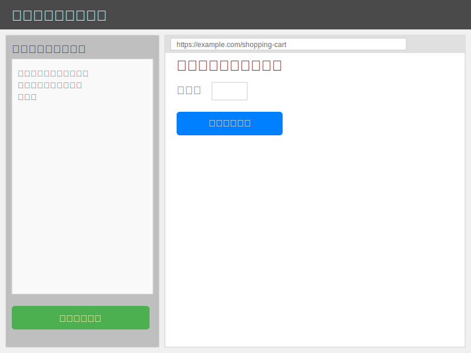

然后，平台在列出所有的测试用例，测试人员继续点击“生成测试脚本”按钮，系统会根据之前收集到的可交互的元素，自动推测每一条测试用例的操作脚本，比方先定位到哪个按钮，然后需要输入什么，然后需要进入哪个新的页面，直到找出完成整个用例的路径。每条测试用例都会生成对应的测试脚本，列在左边的栏目中。

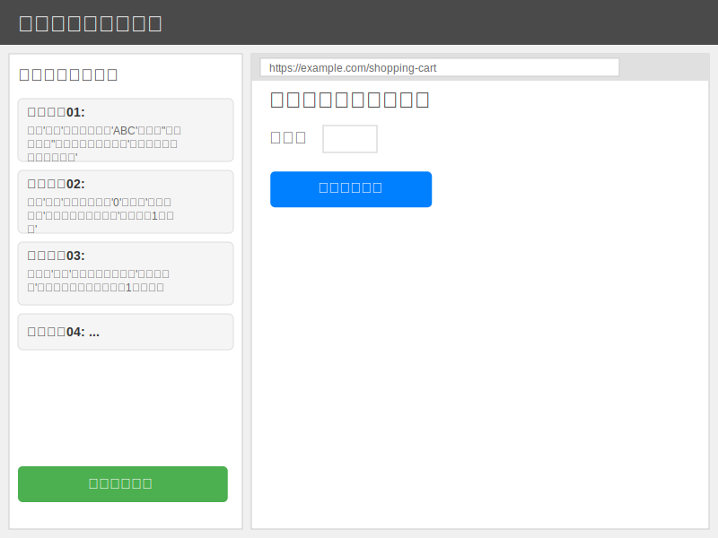

到这里，全部脚本也已经生成了，测试人员可以点击立刻运行脚本，系统会自动运行每一条脚本，运行期间，右边的软件界面也会跟随变动，可以看到脚本运行的效果。如果脚本有问题，也可以手动修改脚本，用户可以在右边的软件界面中手动指定需要点击的内容和操作路径。

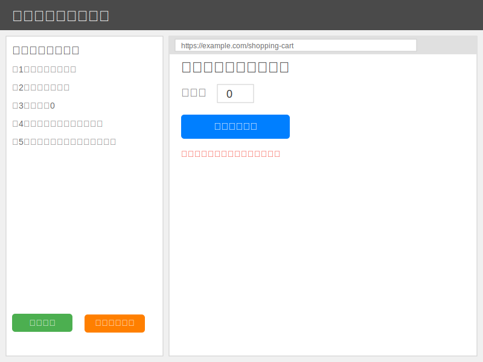

最后，所有的测试脚本都自动操作完成，测试用例是否通过的结果也会得到，测试人员直接点击“查看测试报告”按钮，就可以知道哪些功能正常，哪些功能有问题了。

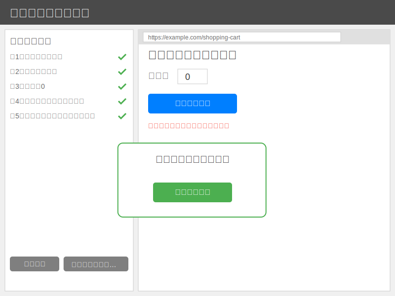

从这个例子可以看出来， Cyberbard 平台超过了现有大部分平台的能力，可以在“功能测试”层面完全做到全流程自动化，基本上可以代替大部分人力的工作，而且测试用的覆盖率可能比传统人工方式更高。整个平台为了自动化的完成任务，使用了很多新的技术和方法，比方识别软件的界面上的文字需要用到Optical Character Recognition（OCR）技术，自动化操纵软件运行测试用例，需要用到Robotic process automation（RPA）技术。但是，最核心最重要的能力，就是需要完成“测试用例”的推导。目前很少有团队在这方面有研究，而这也是本产品的创新点。在后面的章节会详细讲述我们是如何构思的，以及用哪些方面来突破现有技术的限制，实现类似人类的“测试用例”推理能力。

### 3.3 Revenue Model with Pricing Structure

<!-- 收入模型。 一次性收费/订阅费？ 价格区间等信息。 -->

根据市场调研和竞品分析， Cyberbard 的收入模型将采用分级订阅模式（Freemium Model）来平衡用户增长和收入增长。具体包括2种用户：免费用户、订阅用户。

#### 3.3.1 免费用户（Freemium）

目标: 吸引大量用户使用我们的平台，并通过使用过程中逐步引导用户升级到付费版本。
使用限制:
测试次数限制: 每月免费用户可以运行一定次数的测试，例如100次。
并发测试数量: 限制同时运行的测试任务数量，比如最多2个。
测试时长: 对每次测试的最大运行时长进行限制，例如30分钟。
功能限制: 免费用户无法使用高级功能，如复杂的集成测试、跨平台测试、以及AI优化功能。
存储限制: 对测试结果的历史记录进行限制，如只保存最近一个月的测试结果。
收入来源: 虽然免费用户本身不产生直接收入，但可以通过提示用户升级到付费版本解除限制。

#### 3.3.2 订阅用户（付费订阅模式）

分为基础版和高级版两个档次，提供更全面的功能和支持。

##### 3.3.2.1 基础版（Basic Plan）

月费/年费: 比如 £29/月 或 £299/年。
功能: 提供基本的自动化测试功能，没有测试次数或并发数量限制，但可能仍对测试时长进行一定限制，如每次最多2小时。
支持: 提供电子邮件支持，但不包含电话或实时聊天支持。

##### 3.3.2.2 高级版（Pro Plan）

月费/年费: 比如 £99/月 或 £999/年。
功能: 无使用限制，全面解锁所有平台功能，包括AI优化、复杂集成测试、跨平台测试等。
支持: 提供优先支持，包括电话和实时聊天支持。
API访问: 允许集成平台API进行自动化测试脚本的远程管理和触发。

<!-- ### 企业大客户（Enterprise Plan）

定制化服务: 为大型企业客户提供定制化的解决方案，包括但不限于平台的定制开发、专属功能开发、专属支持团队、SLA（服务水平协议）保障等。
收入模式:
固定费用: 企业级客户通常签订年费合同，费用从 £10,000/年 起。
增值服务: 根据客户的具体需求提供定制化开发或额外服务，按项目收费。
按使用量收费: 对于大规模使用的企业客户，可以按月或按年基于使用量（如测试次数、并发测试数量）进行计费。
补充收入来源
市场合作: 与其他工具或平台合作，整合服务，并通过合作伙伴推广进行收入分成。
增值功能销售: 除了订阅套餐外，还可以为用户提供额外的增值功能，比如更快的测试速度、更高的资源优先级、本地化部署等。 -->

#### 3.3.3 未来发展

随着用户基础的扩大和平台功能的提升，收入模型也将逐步优化。我们计划在未来根据市场需求，逐步推出更多有针对性的订阅套餐，以及探索新的收入来源，如允许第三方开发者在我们的平台上销售插件和服务。总之，这个收入模型旨在通过吸引大量免费用户，并逐步将其转化为付费用户，同时开放付费API能力方便用户自助整合到其他系统，从而实现业务的可持续增长。

## 4 Technology

### 4.1 System Architecture Overview

<!-- 系统架构的概览。要有架构图。以及配合架构图的较为详细的说明 -->
为了让产品研发更加高效， Cyberbard 尽可能使用目前已经成熟的技术和框架来实现预期的能力，并且会集中研发资源投入到核心部分“测试领域专用AI推理引擎”。目标就是使用更少的资源快速开发出原型产品，积极收集用户的反馈，不断调整产品细节，更加靠近用户的需求。的整个平台的框架如下图所示：

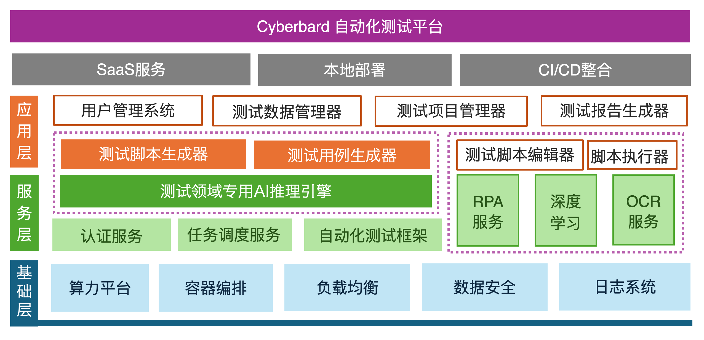

#### 4.1.1 基础层

最底部的蓝色部分是基础层。这里包含了一些最基础的底座设施。其中的算力平台可以为AI引擎提供GPU算力资源。容器编排能力可以管理和部署容器化的测试环境，让整个平台可以稳定运行在互联网上。负载均衡可以确保大量用户涌入的情况下可以顺畅的使用平台。数据安全能力可以保护用户测试数据和结果的安全。日志系统用来记录系统运行和用户执行的日志，方便排查和回溯运营期间的问题。

#### 4.1.2 服务层

往上的绿色部分是服务层。这里面最重要的是“测试领域专用AI推理引擎”，使用AI技术辅助测试过程，如生成测试用例、优化测试策略等。这里也是我们平台的重点部分，后面的章节会详细讲述它的基本结构。认证服务处理用户认证和授权。任务调度服务：管理和调度测试任务的执行，可以让已经设置好的任务按照设定反复运行。自动化测试框架：提供底层的自动化测试支持，第一期计划先支持Web应用，使用内置的浏览器引擎来验证测试用例。RPA服务、深度学习、OCR服务，这三个都是使用一些成熟的开源框架来模拟用户操作自动化查找网页的一些互动元素，并且保存起来供后续其他模块的使用。

#### 4.1.3 应用层

橙色部分是应用层。用户实际使用的每个大功能都对应一个独立的应用，其中的用户管理，测试数据管理，测试项目管理和测试报告生成器都是完成用户操作所必须的能力。“测试脚本生成器”和“测试用例生成器”等能力依托于“测试领域专用AI推理引擎”，也是这里面最重要的应用，其效果的好坏直接影响整套系统的可用性。最后，“测试脚本编辑器”包含了方便用户手动调整一些细节的能力，这是相当必要的。随着AI能力的越来越高，需要手动调节的部分也会逐渐减少。“脚本执行器”就是最终在软件界面上执行自动化测试的能力，目前业内已经有一些成熟开源解决方案，比方 Selenium 等，本产品计划直接继承使用它们的一些能力。

#### 4.1.4 部署方式

第一期会提供的是SaaS服务，方便用户快速接入和使用。第二期会支持CI/CD整合，方便于其他系统，比方Github，gitlab，Bamboo，Jenkins等系统集成，这样的话用户可以无缝切换到我们的系统，不用离开他们熟悉的环境和系统。未来会支持本地化部署，支持在用户自己的私域环境中部署系统，更加安全可控。未来还会支持更多的平台的软件测试，也计划将现有的能力抽象成API，提供给高级用户，自助整合到自己的系统中去。我们专注提供功能测试相关的核心能力。

## 5 Innovation - AI System Design and Implementation

<!-- 创新点。上面的章节应该提到了AI的内容，那么这个章节就重点讲如何在AI这块实现创新。 -->
上面提到，整个系统中，最重要的部分，就是Cyberbard独创的“测试领域专用AI推理引擎”，本章节详细描述我们的设计思路和实现方法，看我们将会如何创新性的将AI技术融合到功能测试的自动化中。

### 5.1 Core AI Model and Fine-Tuning for Software Testing

为了让功能测试自动化，首先需要解决的就是能够自动决定需要测试什么内容，以及判断某一个功能是否测试完成，返回成功和失败的结果。在传统的做法中，这些步骤都需要测试人员手动制定。随着技术的发展，人们研发出了很多新的方式来降低每一个环节的成本。目前业内已经开始使用深度学习（DL）和强化学习（RL）技术进行自动化测试。通过学习人类测试员的行为，这些方法旨在生成类似人类的操作和交互，以更全面和有效地测试应用程序的功能。这些方法基于这样一个观点：测试算法执行的操作越接近人类用户的操作，测试就会越全面和有效。尽管如此，基于DL或RL的功能测试方法仍存在一些限制。

- 训练算法需要大量的数据，而这些数据很难从现实世界用户交互中收集。这是因为现代应用程序程序的复杂和动态特性，它们可能有数十甚至数百个不同的页面，每个页面都有其自己独特的交互集和可能的用户行为及逻辑。此外，这些方法生成的测试输入与真实用户交互痕迹显著不同，导致测试覆盖率低。
- 训练算法被设计为从训练数据中学习并进行预测，所以它们可能无法很好地泛化到新的、未见过的情况，因为应用程序在不断演变和更新。
- 应用程序可能是非确定性的，这意味着每次执行动作的结果可能不总是相同的（例如，从具有最后一个内容的列表中点击“删除”按钮将产生一个空列表，此时删除按钮不再工作），这使得RL算法特别难以学习和做出准确的预测。

因此，迫切需要另一种更有效的方法来生成类似人类的操作，以全面测试种类繁多的应用程序。大型语言模型（LLMs），如GPT-3/4，已成为自然语言理解和问答的强大工具。LLM在这些模型的最新进展激发了各种研究，这些研究检查了这些模型在软件开发任务中的使用。OpenAI的ChatGPT（通过聊天交互的生成式预训练变换器）拥有数十亿个参数，并且经过了大量数据集的训练，包括测试脚本和错误报告。其在多个领域和主题上的卓越表现展示了LLM理解人类知识并以知识渊博的专家身份与人类互动的能力。受ChatGPT启发，我们提出了 Cyberbard 方案，将功能测试问题表转化为问题和回答（Q&A）任务，即让LLM扮演人类测试员的角色来测试目标应用程序。所以我们在实现过程中存在的主要挑战是需要一个擅长推理“测试用例”等测试相关能力的专业领域大语言模型。

#### 5.1.1 专业模型的必要性

为什么市面上的通用大模型提供基础服务能力后，还需要测试领域大模型的存在？举个例子：通用大模型好比抽象的交通工具，代表了通用领域能力，不是具象化的交通工具概念。交通工具都可以运送货物，飞机、轮船等是交通工具，但是它们有自己的特点，如果将货物运送到公路边的地方，还是需要汽车更加合适。

测试领域的私域语料丰富，特别是本产品涉及到的“软件测试”的相关数据，是通用大模型难以涉及全面的。下图是我们的专业模型“测试领域专用AI推理引擎”的整体结构：

#### 5.1.2 数据层

包括软件测试领域数据和通用领域数据。它们提供了大模型训练和优化的基础数据支持。对于 Cyberbard 来说，软件测试领域数据是至关重要的，也是区分我们和其他产品的重要标志。目前市场上大部分产品都在研究代码相关的“单元测试”数据，很少有功能测试的相关数据来训练。因为，单元测试只需要输入代码，然后返回代码，都是单一的文本到文本的一次性输入，相对容易，但是功能测试需要关联多变的图形化界面和多重操作步骤，很难映射为适合LLM的对话结构。为了解决这个问题，首先，我们会大量筛选需要的测试数据类型，比方产品说明文档，测试用例文档等，尽量覆盖各种软件类型。
同时我们也会配合一些通用数据来保持基础模型在通用领域的一些固有能力不出现问题。

#### 5.1.3 数据工程层

包括数据构造、数据选择和数据使用。这一层确保数据的高质量和适用性，为大模型的训练提供良好条件。这个工作也非常重要，会在在以后不断完善，积累下来的独特的优良的测试行业微调数据会成为我们的护城河。保证我们产品的最终性能，也让竞争对手难以超越。

后面的步骤的效果的好坏，主要在于输入参数的质量的高低，也就是这里准备的数据质量是否足够。目前并没有专门针对功能测试进行微调的大模型，为了更好的微调效果，我们设计了一种结构，将软件界面的元素和操作映射成多轮对话的形式，形成训练数据、验证数据和测试数据。目前数据来源与自己生成的测试用例和网上公开的测试用例数据。

功能测试集应该包含:

- 软件界面描述:包括界面上的页面信息，文字、按钮、输入框等控件的详细信息。
- 对应的高质量测试用例:由专业测试人员编写的完整测试用例。
- 对应的高质量测试脚本:由专业测试人员编写的完整测试脚本。

最后转化为的微调数据结构可以是两种:
生成测试用例：

- 输入: 软件界面描述
- 输出: 对应的测试用例

生成测试脚本

- 输入: 对应的测试用例
- 输出: 对应的测试脚本

为了获得足够多样化的数据,我们应该收集不同类型软件的界面和测试用例,包括不同行业的软件界面和产品交互数据。理想情况下,数据集应该包含至少几千个这样的样本对。

这个过程也就是“数据构造”。去收集语料集是简单的，但是根据语料集去编写上述高质量的微调数据结构是十分困难且成本不可控的。目前只考虑模型微调的情况下，通常构建微调数据的方法大的方面来说有人工标注和格式化已有数据集。在格式化已有数据集中常见的方式有Self-Instruction和Self-QA等方式。其中Self-Instruction是指根据提前编写好的种子指令，让大模型比如GPT-4去参考种子指令去生成更多的微调数据；如果提前没有种子数据，就可以采用Self-QA方法直接根据非结构化的文档来来生成微调数据。为了保证测试数据都是有效的精选的，人工标注是最好的生产方式，我们有可能自己对这些文档进行人工标注并转换为可用的数据结构，甚至在需要的时候，比方没有足够的数据的时候，我们会根据不同的软件类型编写文档自己生产一些数据。为了控制成本，我们计划两种方式相结合来提高标注效率。

在构建好微调数据之后就需要进行“数据选择”。数据选择就是在微调数据中选择最适合模型训练的数据子集作为最终的训练数据集。数据选择中目前常见的做法就是通常首先要先进行数据去重，然后基于Nuggets方法来实现最优数据集的选择。这个方法有三个输入分别是：一个大模型，用来评估数据好坏；Predefined Task Set 用来辅助评估数据好坏；Instruction Set就是等待筛选的大数据集。输出目标就是Instruction Set的优秀子集，被称为Golden Set。它认为，如果一条数据作为one-shot的那个shot，即作为一条例子作为参考，能使得大模型有这个参考后，比zeroshot提升很多，就认为这是一条高质量的数据。

“数据使用”的主要工作就是保证在训练和迭代中调整数据配比，根据实际情况进一步优化数据，防止出现灾难性遗忘。

#### 5.1.4 大模型层

本层是平台实现能力的重点能力模块，相当于系统的大脑。原始数据通过本层的学习和优化，形成了对各种软件界面都可以生成测试用例和测试脚本的能力。

#### 5.1.5 基础模型

为测试专业大模型选择合适的基础模型是非常必要的。没有好的通识知识，后期的专业数据的微调也会很难达到预期目的。就像一个文盲，不会读书写字，再怎么教他专业知识，他也是学不会的。在选择基座模型进行垂直领域微调时，需要综合考虑模型性能、规模、社区支持与文档、可扩展性与兼容性、训练数据的适用性、训练与推理效率、安全以及成本等多个因素。
考虑到测试行业的特点，我们的要求会聚焦在，要能比较好的理解文字中的语法和比较强的推理能力。目前排名比较靠前的开源LLM引擎都比较符合我们的要求。比方ChatGLM3-6B-Base，有足够的预训练数据，良好的开发社区和扩展能力，有商用授权，和现有的开发框架结合较好。具体的选择还需要进一步的对比评测才能确定。

选择了基础模型以后，下一步就是对基础模型进行微调。不同的专业场景面有不要的要求，比方有的要求信息新且大量，有的要求能输出某种特定风格的句子。不同的要求对技术的选型也不同，一般来说，提高某个专业领域的能力，有三种方式来实现，分别是：提示工程，RAG，微调。

- 提示工程使用相对简单，灵活，成本低，但是非常依赖基础大模型，对于高度专业化的信息效果不确定。
- RAG 方式优点是可以随时整合外部最新的信息进行输出，适合信息的整理和快速索引，但是不适合整体性的修改模型的风格和推测能力。
- 微调方式适合融合领域知识进行推理的场合，虽然训练相对复杂，但是更加适合我们的产品。

现在有很多种不同的微调方式。基于功能测试领域，专有数据并不多的情况下，同时我们还希望尽量保留基础模型的推理能力。LoRA方式的微调是我们的首选方案，其他的方式会作为配合使用。一方面是它在小数据的情况下的效果非常好，一方面它更加低的训练中内存使用量和更快的训练时间。特别是在新的领域中，新的训练数据会不断补充进来提高模型的性能，全参数调整效率太低，LoRA微调可以让我们的产品性能迭代更加快速，适应市场的变化。

在针对垂域大模型搭建的过程中完整的流程一般为继续预训练，有监督微调，对齐微调，人类反馈强化学习（Reinforcement learning from human feedback）等。
继续预训练需要大量的语料库，不适合“功能测试”的场景。根据实践，一般来说有“监督微调”加上“对齐微调”就可以达到一个比较好的表现。下面主要说一下微调方案的实现。

#### 5.1.6 微调模型

目前主要流行的微调的有 Lora（Low-Rank Adaptation）和Prompt Tuning v2等。 LoRA 是一种通过引入低秩矩阵的方式来微调预训练模型的方法。它通过对预训练模型中的部分参数（通常是注意力层中的投影矩阵）进行低秩近似，从而显著减少微调时的参数量。这种方法允许对大模型进行高效微调，而不需要调整模型的全部参数。 同时，LoRA 的优点在于它不改变原始模型的结构，并且通过低秩矩阵的引入，只需保存额外的参数矩阵，而非整个模型参数。因此，它是一种非常有效的参数高效微调方法。所以，Lora 比较适合本产品在现阶段的要求。

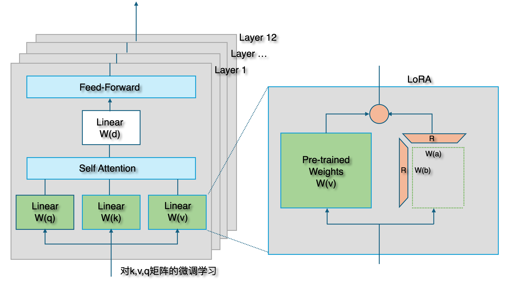

在大规模语言模型（LLM）的微调过程中，LoRA（Low-Rank Adaptation of Large Language Models）算法是一种非常有效的技术。LoRA通过将原始的权重矩阵的微调过程限制在低秩子空间中，来减少模型参数的数量，同时保持较高的性能。正如图中所示，LoRA 的核心思想是通过两个小矩阵 W(a) 和 W(b) 的乘积来近似表示原始权重矩阵，通过这种方式来显著减少了参数量。
LoRA 的有效性主要来源于以下两个方面：

- **低秩近似**：在实际的大规模神经网络中，权重矩阵的变化通常是低秩的，也就是说，这些变化可以用少量的信息进行有效表达。低秩近似利用了这一点，通过对矩阵的秩进行限制，减少了参数的数量，同时保留了主要的变化信息。

- **优化过程**：由于 W(a) 和 W(b) 都是小矩阵，相比直接微调完整的权重矩阵，优化这两个矩阵所需的计算资源更少。此外，由于微调是在低秩子空间中进行的，这也有助于防止过拟合，保持模型的泛化能力。

上图的左侧是传统的LLM模型中的某一层，LLM包含非常多的层，每个层中也包含了通过实验可以发现，LoRA 通常在模型微调时被用于 Transformer 模型的自注意力（Self-Attention）机制中，尤其是在查询 W(q) 和值 W(v) ，有时也在键 W(k)。这种选择背后有几个原因，主要涉及到模型效率、特定层的作用以及对最终性能的影响，具体说来有下面几个方面：

- 参数效率：微调时关注于最能影响模型输出和性能的部分。W(q) 和 W(v) 直接影响到注意力权重的计算和最终的输出表示，因此在这些层上进行调整可以更直接地改变模型的行为。
- 影响信息选择：通过调整 W(q)，可以影响模型如何选择信息（即，它“注意”哪些信息），而通过调整 W(v)，可以影响一旦选择了某些信息，模型如何利用这些信息。W(k) 主要影响的是信息的匹配方式，而在许多情况下，调整 W(q) 和 W(v) 已足够引导模型关注到更有用的信息上。
- 计算效率：虽然LoRA的目的是通过低秩更新提高参数效率，但在所有层上应用这种更新仍会增加额外的计算负担。因此，从中间挑选对最终性能影响最大的层进行调整可以在增加最小计算成本的同时获得最大的性能提升。
- 实验和经验：实际应用中的经验和研究表明，在Q和V层上应用LoRA微调通常能够有效改善特定任务的性能。这可能是因为这些层在模型中扮演着关键角色，对输出的影响较大。

#### 5.1.7 奖励模型训练

为了进一步提高生成测试用例的质量,我们可以训练一个奖励模型来评估生成的测试用例。这个过程包括:

- 收集人工评分数据:让测试专家对一部分生成的测试用例进行评分,评分标准可以包括覆盖率、可执行性、有效性等。
- 训练奖励模型:使用收集到的评分数据,训练一个模型来预测测试用例的质量分数。
- 强化学习微调:使用训练好的奖励模型来指导主模型的进一步优化,鼓励生成高质量的测试用例。

#### 5.1.8 评测层

每一层有对应的评测要求，数据层主要是针对数据质量的评估，数据工程层中则是针对数据配比和训练数据进行评估，大模型层包括测试领域和通用测评集，也会自建测评集。应用效果的测评是需要厘清业务收益和业务效果。通过全面的评测，确保大模型在实际应用中的有效性和可靠性。

为了评估模型的性能,我们可以设计以下评测方案:

- 自动化指标:

BLEU分数:比较生成的测试用例与人工编写的测试用例的相似度。
覆盖率分析:评估生成的测试用例对软件功能的覆盖程度。
语法正确性:检查生成的测试用例在语法上是否正确。

- 人工评估:

可执行性:测试人员尝试执行生成的测试用例,评估其可执行性。
有效性:评估测试用例是否能发现潜在的软件缺陷。
创新性:评估模型是否能生成一些人类测试人员可能忽略的测试场景。

- 实际应用测试:

在真实的软件测试项目中使用该模型,比较使用模型前后的测试效率和缺陷发现率。

### 5.2 Automatic Testing With AI

通过上面的步骤训练出“测试领域专用AI推理引擎”（简称“专用引擎”）以后，配合平台的其他服务和模块，就可以完成自动化的功能测试，具体的流程如下图所示：

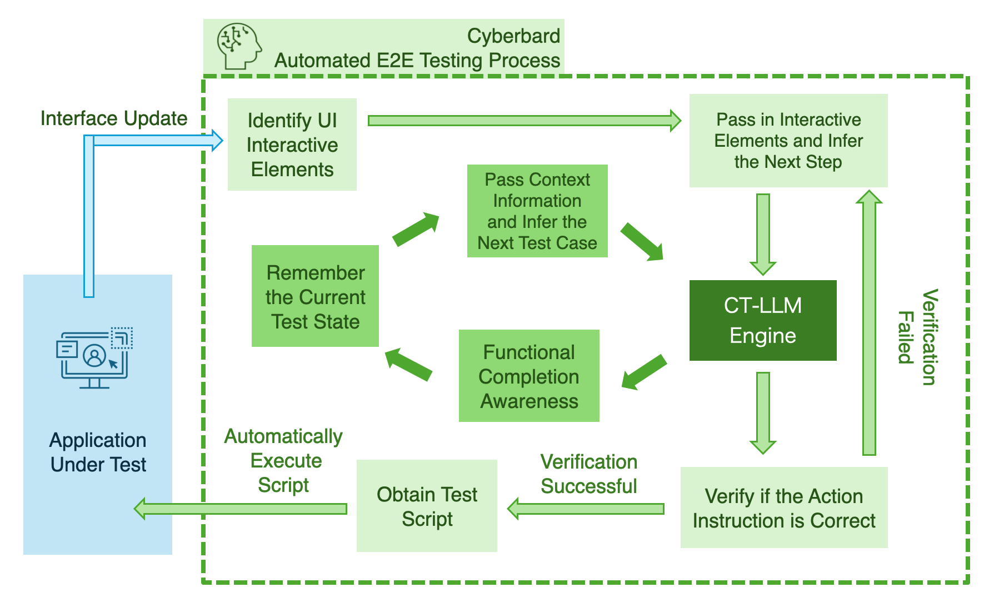

Cyberbard 通过两种循环的操作来完成一个一个的测试用例，并且不断执行，直到最后完成整个自动化的功能测试过程任务。

首先，在内层循环中，系统的主要任务是检测本次功能测试需要测试的下一个功能是什么，然后拆分出测试用例，完成一个测试用例则执行下一个，直到所有的功能都覆盖到，退出循环。我们的主要操作就是构建了一个“测试状态记忆器”来记录所有详细的交互测试信息，例如探索的页面和控件。在此过程中，记忆器还存储了测试的功能级进度，例如正在测试哪个功能，这是通过循环询问“专用引擎”进行明确推理来实现的。要注意的是，图中的“上下文信息”不但有外循环传过来的UI信息，每次测试的记录，已经完成的部分，也包含了最开始测试人员用自然语言描述的一些功能的提示。我们还设计了一套promput的语言模板，将这些“上下文信息”每次都可以通过固定的格式输入“专用引擎”，使它能够保留整个测试的知识并进行长期推理。

然后，外层循环主要目的是通过推测出每一步的操作完成一个测试用例。完成这个过程需要和“待测试软件”进行交互，所以需要其他服务的配合，首先，通过OCR技术扫描软件界面，提取当前UI页面的UI上下文信息。这种方式可以无需关注“待测试软件”的具体框架，也无需得到软件的代码，是最模仿软件测试人员的一种工作方式。下一步，将获取到的UI元素通过设计好的模版编码成“专用引擎”的Prompt提示，然后验证反馈的下一步操作，如果不成功则继续重新反馈，如果成功则执行反馈答案中包含的可以执行的测试脚本。也就是通过PRA来控制“待测试软件”的界面自动执行脚本。整个过程不断循环，直到当前测试用例测试完成，然后等待“内层循环”给出的下一个指示。

这样迭代整个过程。 在双循环的作用下，整个“待测试软件”的功能会逐一被覆盖。第一次执行可能会耗时比较久，以后软件功能升级的时候，系统会从历史数据中对新扫描到的UI元素进行优先推理，同时也会将旧的相关元素进行重新扫描，如果判断有影响到旧功能，也会重新自动执行相关循环，最后将改动记录到对应的“测试用例”和“测试脚本”中。整个过程基本上不需要测试人员的参与，最后只需要查看生成的测试报告即可。

<!-- ## 5.3 Platform R&D Structure

这部分感觉其他已经包含了。 -->

### 5.3 The Final Production Technology Pathway

本章节将详细描述基于大模型的AI自动化测试平台中微调模型的研发计划。整个研发计划分为三年时间，每个阶段的目标明确，并且研发进度按季度细分，以确保产品能够稳步推进，逐步达到商业化目标。

#### 5.3.1 基础技术研究与原型开发（0-6个月）

**目标：**

- 建立微调模型的技术基础，开发初步原型。

**研发内容：**

1. **第1季度（0-3个月）**
   - **技术调研与需求分析：** 针对自动化测试平台的具体需求，确定基础模型，深入研究当前主流的大模型微调技术，包括LoRA等模型的微调方法。分析业务场景对微调模型的需求，明确微调模型需要解决的核心问题。
   - **数据收集与预处理：** 收集目标业务场景中的测试数据，并进行数据清洗和标注，形成高质量的训练数据集。设计数据增广策略以增强模型的泛化能力。
   - **原型设计：** 根据需求分析和数据特点，设计微调模型的架构，明确模型的输入输出形式和主要调优参数。

2. **第2季度（3-6个月）**
   - **原型开发：** 开发微调模型的初步原型，针对自动化测试任务，尝试不同的微调参数。实验不同的模型架构以验证其在目标任务上的有效性。
   - **初步测试与评估：** 对模型原型进行初步测试，评估模型在小规模数据集上的性能，并根据测试结果进行初步优化。
   - **文档与代码管理：** 完成原型开发的相关技术文档编写，并建立代码管理和版本控制流程。

#### 5.3.2 测试版开发与试用推广（6-12个月）

**目标：**

- 开发并发布微调模型的测试版，吸引trail用户进行试用，并根据反馈进行优化。

**研发内容：**

1. **第3季度（6-9个月）**
   - **模型优化与扩展：** 基于第一阶段的原型，继续优化模型的微调策略，并扩大训练数据集。探索使用迁移学习和多任务学习来提高模型的泛化能力和在不同测试场景中的表现。
   - **测试版发布准备：** 完善测试版的模型，集成到自动化测试平台中，确保模型能够与平台的其他功能模块无缝协作。准备好测试版发布的相关文档，包括用户指南和技术白皮书。
   - **Trail用户招募与支持：** 发布测试版，开始招募trail用户。建立用户支持渠道，包括技术支持和反馈收集机制。

2. **第4季度（9-12个月）**
   - **用户反馈收集与分析：** 收集trail用户的反馈，分析模型在实际应用中的表现。识别模型的不足之处，并记录用户对模型功能和性能的需求。
   - **模型迭代与优化：** 根据用户反馈和使用数据，对微调模型进行迭代优化。包括调整模型参数、改进微调策略以及增强模型的可解释性和易用性。
   - **测试版评估报告：** 编写测试版的评估报告，总结模型在试用期间的表现，确定下一步的优化方向。

#### 5.3.3 正式版本发布与持续改进（第2年）

**目标：**

- 发布微调模型的1.0正式版本，并持续进行优化和功能扩展。

**研发内容：**

1. **第5季度（第2年1-3个月）**
   - **1.0版本开发与优化：** 基于前一年的研发成果，完成微调模型的最终优化。解决测试版中出现的关键问题，进一步提升模型的稳定性和性能。
   - **正式发布准备：** 制定1.0版本的发布计划，准备市场推广材料和技术支持文档。与平台的其他模块团队协作，确保1.0版本的发布顺利进行。

2. **第6季度（第2年4-6个月）**
   - **1.0版本发布：** 正式发布微调模型的1.0版本，向所有用户开放。通过社交网络、网络推广和行业交流等方式进行市场推广，吸引更多用户使用平台。
   - **用户文档与技术支持：** 完善用户文档，帮助用户更好地理解和在实际场景中使用Cyberbard。建立长期的用户反馈机制，以便持续改进。

3. **第7-8季度（第2年7-12个月）**
   - **持续优化与新功能开发：** 根据用户反馈和市场需求，对微调模型进行持续优化。探索新的微调技术，开发新功能，保持产品的竞争力和创新性。
   - **扩展应用场景：** 针对不同的业务场景，扩展微调模型的应用范围，开发专门针对特定平台的模型。增加平台能力的调用方式方便用户自助集成。

#### 5.3.4 持续维护与能力拓展（第3年）

**目标：**

- 维护微调模型的稳定性，持续推出新版本，并增加能力，扩大市场覆盖面。

**研发内容：**

1. **第9-12季度（第3年1-12个月）**
   - **版本更新与维护：** 持续监控微调模型在用户中的表现，定期发布更新版本，修复已知问题并提升模型性能。
   - **新技术探索：** 跟踪AI领域的最新研究进展，探索前沿的微调技术，并将其应用于产品中，保持技术领先性。
   - **商业拓展与合作：** 积极拓展市场，与不同行业的企业合作，推动微调模型在更多应用场景中的落地。打造技术开放平台，开放AI能力给第三方，寻求与其他技术供应商的合作，提升产品的生态系统价值。

#### 5.3.5 技术路径总结

通过上述三个阶段的研发计划，基于大模型的AI自动化测试平台中的微调模型将在第一年完成基础技术研究与原型开发，第二年发布1.0正式版本并进行持续优化，第三年则专注于市场拓展与技术创新。该计划的实施将确保产品在技术层面具有领先性，同时满足市场需求，最终实现商业化成功。

## 6 TECHNOLOGY DEVELOPMENT ROADMAP

<!-- 未来3年的系统研发规划路线图。时间节点到季度就可以了。 -->
本章将详细描述Cyberbard自动化测试平台未来三年的系统研发规划路线图。该路线图旨在通过分阶段的开发与优化，逐步实现平台的核心功能、扩展应用场景，并最终满足广泛用户的多样化需求。具体规划如下：

### 6.1 核心功能开发与初步推广

#### 第一年：核心功能研发

#### Q1: 技术调研与架构设计

- **技术调研**：进行深入的市场调研和技术研究，确定适合平台的关键技术栈，分析竞品功能，并识别用户痛点和需求。
- **架构设计**：在技术调研的基础上，设计平台的总体架构，确定各模块的功能需求、数据流动和交互方式。
- **AI推理引擎调研**：特别针对AI推理引擎，调研现有技术和算法，制定符合测试场景需求的AI模型选型方案。

#### Q2: 平台核心框架与AI推理引擎开发

- **核心框架搭建**：完成平台的核心框架开发，包括基础层（算力平台、容器编排、负载均衡和数据安全）的搭建和整合。
- **AI推理引擎开发**：基于前期调研，开发测试领域专用的AI推理引擎，初步实现智能化的测试脚本和用例生成功能。
- **认证与调度服务**：部署认证服务和任务调度服务，为后续的功能开发提供支持。

#### Q3: 应用层开发与SaaS平台上线

- **应用层主要模块开发**：
  - 开发用户管理系统、测试数据管理器和测试项目管理器，构建平台的基本功能框架。
  - 实现测试脚本生成器和测试用例生成器，通过AI推理引擎支持，初步实现智能化测试功能。
- **SaaS服务上线**：完成Web平台的开发，支持SaaS服务模式，进行小范围的试用用户招募，提供平台的核心测试功能。

#### Q4: 用户反馈收集与功能优化

- **用户反馈收集**：从试用用户处收集反馈，分析功能的使用情况和用户体验，识别需要改进的领域。
- **功能优化**：根据反馈对系统功能进行优化，修复bug，提升系统稳定性和性能，完善用户界面和交互体验。
- **准备进一步推广**：为下一步的全面推广和CI/CD集成做好准备。

#### 第二年：CI/CD整合与平台扩展

#### Q1-Q2: CI/CD集成与稳定性提升

- **CI/CD整合**：全面整合持续集成和持续交付（CI/CD）工具，确保系统可以快速部署和更新，提升开发效率和发布速度。
- **平台稳定性优化**：通过CI/CD集成，实现对平台各模块的自动化测试和持续改进，确保平台的稳定性和可靠性。
- **性能优化**：对核心框架和应用层进行性能调优，提升系统响应速度和处理能力，支持更多用户同时访问。

#### Q3-Q4: 支持平台扩展

- **移动端平台扩展**：扩展系统的支持范围，从Web平台扩展到移动端，分别开发和上线支持Android和iOS的应用程序。
- **跨平台功能优化**：对移动端应用进行优化，确保跨平台的统一性和流畅性，集成移动端专用功能，提升用户体验。
- **用户群扩展**：在移动平台支持后，进一步扩大用户招募范围，涵盖更多的应用场景和用户群体。

### 第三年：本地部署与API开放

#### Q1-Q2: 本地部署方案开发

- **本地部署框架设计**：根据市场需求，设计并开发平台的本地部署版本，支持企业级客户的私有化部署需求。
- **数据迁移与安全保障**：针对本地部署的需求，开发数据迁移工具和增强的数据安全措施，确保用户数据的私密性和完整性。

#### Q3-Q4: API开发与生态系统扩展

- **API开放**：开发并开放平台的API接口，支持第三方应用的集成，促进平台的生态系统建设。
- **开发者支持**：为开发者提供详细的API文档、SDK和开发者工具包，鼓励更多的第三方开发者在平台上进行二次开发。
- **社区建设与推广**：通过开放API，推动开发者社区建设，扩展平台的影响力和市场覆盖面。

### 产品路线图总结

通过这三年的开发路线图，Cyberbard自动化测试平台将从技术调研、核心功能开发逐步走向全面的功能扩展和市场推广。平台将通过持续的优化与创新，不仅在Web端实现稳定的自动化功能测试服务，还将扩展至移动端，并最终支持本地部署和API开放，满足更广泛的企业和开发者需求。

## 7 IP Protection and Patent Strategy

<!-- 知识产权的策略。在这里写出你的创新部分的哪些内容在未来是可以申请专利的。例如：独特的算法、深耕行业领域的解决方案等。请注意，只有工具属性的软件才可以申请专利，如果是消费属性的软件是不可以的。具体要看专利律师给出的专业建议。 -->

在Cyberbard的规划中，我们提出了一系列具有创新性和潜在专利性的技术方法，旨在通过AI技术彻底革新功能测试流程。这些技术不仅填补了现有技术中的空白，还通过独特的实现方式提高了功能测试的效率、准确性和自动化程度。下面是我们识别出来的可能的潜在专利点。

### 功能测试自动化的全流程管理系统

- 技术创新：开发了一套全流程的管理系统，能够无缝对接数据收集、模型训练和功能测试的各个环节，实现了测试流程的全自动化。该系统包括了自动数据注入、模型预测、结果分析与反馈的闭环流程，确保了测试的全面性与自动化。
- 潜在专利点：整合的数据收集、模型微调、功能测试执行与结果分析的系统架构和运作方法。
- 专利优势：该系统可以极大提升测试工作的效率和准确性，并减少人工干预，从而在功能测试领域内带来革命性变革。

### 基于LoRA微调的行业大模型训练方法

- 技术创新：使用LoRA（Low-Rank Adaptation）技术对预训练的大模型进行行业特定的微调，特别是针对功能测试领域的微调。这种方法允许在少量数据的情况下，快速高效地调整大模型的权重，使其在处理测试任务时具有更高的准确性和效率。
- 潜在专利点：基于LoRA微调技术的特定算法或流程，特别是应用于测试行业的微调策略和训练流程的具体实现。
- 专利优势：相较于传统的大模型训练方法，这种微调方法显著降低了训练成本，并且能够在特定领域内提供更为精确的模型输出。

### 测试数据的特殊格式与大模型适配机制

- 技术创新：设计了一种特定的格式，用于将功能测试数据进行结构化处理，使其能够更好地适配和被大模型处理。该格式考虑到了测试数据的独特需求，如数据类型、依赖关系等，并设计了特定的编码和解码机制，以确保模型的输入和输出的高效处理。
- 潜在专利点：功能测试数据的专用格式及其与大模型的适配机制，包括编码、解码方法和数据处理流程。
- 专利优势：这种特殊格式与适配机制可以确保功能测试数据在模型中的高效处理，从而提升了测试结果的准确性和模型的应用广泛性。

## 8 KEY PERSONNEL

团队关键人物

### 8.1 [You] – Founder and CEO

创始人信息，主要就是你的信息，要保持跟简历一致。一段表述文字即可。

### 8.2 KEY ADVISORS

如果有关键的顾问的话，可以写在这里。例如：行业专家顾问，非技术背景创始人的技术顾问等。

### 8.3 Three Years Recruitment PLAN

3年的团队招聘计划，要匹配前面的研发计划。

## 9 MARKET RESEARCH

<!-- 市场调研
在这里分节罗列出所有的市场调研动作。例如：对测试软件市场总体规模的调研内容，全球的现状，英国的现状，发展趋势（包括技术、市场）等。 -->

### 测试软件市场现状概述

随着软件应用程序变得越来越复杂和功能丰富，需要进行广泛的测试以确保性能、功能以及安全性，从而增加了对测试解决方案和服务的需求。

在当前竞争激烈的市场中，提供具有最佳用户体验的高质量软件对于客户满意度和留存率至关重要。这就是为什么公司必须投资于强大的测试方法，以便在开发过程的早期阶段发现和纠正任何缺陷。随着敏捷和 DevOps 方法论的流行，鼓励迭代开发、持续集成和交付，这导致对使用自动化测试工具以及可以加快发布时间而不损害质量的流程的需求增加。但是，资源限制和预算限制会限制组织投资大量测试工具、流程和高技能人员的能力，从而影响测试结果的有效性和质量。缺乏经验丰富的测试专业人​​员，又不了解人工智能（AI）、机器学习等新技术，这可能会对寻求采用尖端测试实践和工具的企业构成挑战。这些因素让测试软件市场在新需求不断涌现的情况下逐渐扩大。

根据 [GMI](https://www.gminsights.com/industry-analysis/software-testing-market)的市场调研数据，2023年全球软件测试市场规模已达到518亿美元，预计在2024年至2032年期间，该市场的复合年增长率将超过7%。这种增长主要得益于大型公司不断推出新产品和进行技术创新。此外，随着技术的快速发展，各公司面临着越来越大的压力，必须提供卓越的软件解决方案，以满足用户不断变化的需求。这些因素导致了对无错误软件的需求不断增长，进一步刺激了市场对先进测试工具和技术的需求。尤其是应用测试自动化市场，预计到2032年底将超过973亿美元的规模。

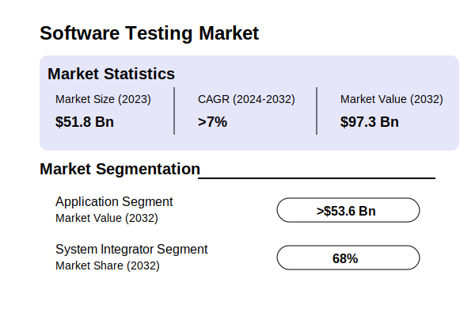

图片来源：[GMI Dlobal Market Insights](https://www.gminsights.com/industry-analysis/software-testing-market)

北美是软件测试市场最大的也是最发达的市场，在[For Insights Consultancy](https://www.forinsightsconsultancy.com/reports/software-testing-market/)的报告中，北美市场占全球市场价值的37%。由于外包和数字化趋势的不断增加，亚太地区的市场规模也正在经历快速增长。软件测试行业在北美有比较久的历史，很多大型的上市公司或者服务团队提供广泛的软件测试服务，里面包含很多巨头企业，比方，埃森哲，IBM等。除了这些大型企业和软件测试公司外，市场中还分布着一些新兴公司，它们专注于特定的测试领域技术、行业或技术，比方Selenium，katalon等。它们试图使用新的技术和更加便捷的服务在这个动荡且快速变化的行业中脱颖而出并赢得市场。

关于英国本土市场，根据[IBISWorld's Software Testing Services in the UK Industry Report](https://www.ibisworld.com/united-kingdom/market-research-reports/software-testing-services-industry/)，整个2024 年英国软件测试服务行业的市场规模为 12 亿英镑。2019 年至 2024 年期间，英国软件测试服务行业的市场规模以 1.6% 的复合年增长率增长。英国软件测试服务行业共有 662 家企业，占有较多份额的公司有 Intertek，Keysight Technologies，DXC Technology 等等。相对于北美市场的多样性，英国的测试软件公司主要为占有主导市场的大型行业客户提供测试服务，在创新性方面还有较大的提升空间。

### 中小软件企业占比

麦肯锡的报告《[Beyond financials: Helping SMEs thrive](https://www.mckinsey.com/industries/public-sector/our-insights/beyond-financials-helping-small-and-medium-size-enterprises-thrive)》对多个国家发展数据进行了深入研究。研究发现，在加拿大，中型公司占所有公司的1.6%，但却贡献了12%的GDP。在马来西亚，中型公司占所有公司的2%，却贡献了该国约40%的GDP。与其规模相比，这些较小的公司产生的影响却很大。有证据证明，中小企业对国家财富的贡献超过了其分内的额度。根据[世界银行](https://www.worldbank.org/en/topic/smefinance)的数据，中小企业数量约占所有公司的90%，提供全球50%的就业，并且在新兴市场贡献高达40%的国内生产总值。

同样的，在全球软件及服务企业中，根据[Abessoftware lDC](https://bg.qianzhan.com/)的研究显示，中小企业占据了绝大多数。相关数据显示，小微企业数量占比高达95%。具体而言，员工少于10人的企业占比为48.2%，员工在10-99人之间的企业占比为46.8%。这些数据表明，软件行业中的企业大多数为小型和微型企业，行业集中度相对较低。满足他们的需求有巨大的市场潜力。

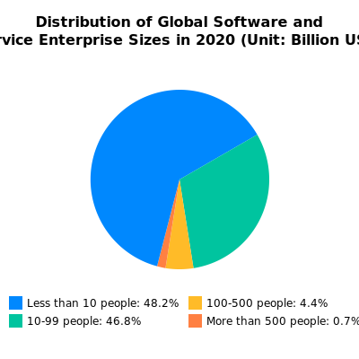

图片来源：[Report of Market Prospective and Investment Strategy Planning on China Software Industry(2024-2029)](https://bg.qianzhan.com/report/detail/4a047030ec144047.html)

### 中小企业的需求与挑战

虽然上面的情况看起来令人振奋，但却掩盖了中小企业必须克服的困难。中小型企业经常面临激烈的竞争，而且竞争的范围越来越全球化，这也是它们失败率高的部分原因；它们的资源有限，这意味着它们不总能建立起强大的保障体系；而且往往不能投资于可以帮助其节省时间和金钱的技术。在软件开发领域，但相较于大型企业，中小软件企业在测试资源的分配上相对匮乏。根据Statista的报告，25.6%的小企业测试人员占比少于10%，26.2%的小企业测试预算占比少于10%。这表明，绝大多数小企业因资源有限，难以配备足够的测试人员，且当前市面上的自动化测试工具往往过于庞大复杂且价格高昂，使得许多中小团队难以承担这些成本，仍停留在手动测试阶段。

中小型企业的测试预算统计：

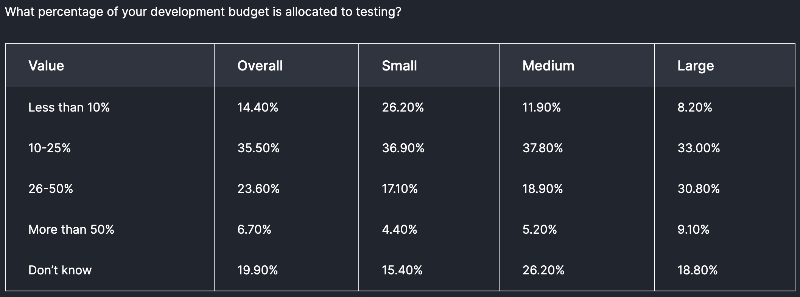

中小型企业的测试人员数量统计：

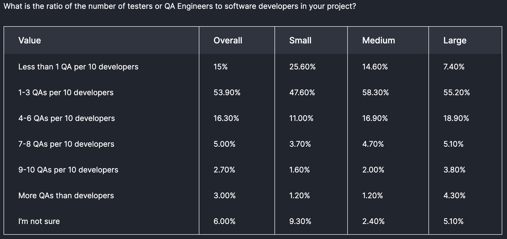

图片来源：[Future of QualityAssurance](https://www.lambdatest.com/future-of-quality-assurance-survey)

### 自动化测试工具市场的机会

随着软件测试市场的不断扩大，中小企业对于简便、成本可控且易于使用的自动化测试工具的需求日益增加。调查显示，超过一半的受访者认为软件测试成本是企业面临的最大挑战之一。这意味着，市场急需一些智能解决方案来帮助中小企业降低软件测试成本，同时保证软件质量不受影响。

此外，对于“测试中不准确的设置造成的损失”的担忧也在不断增加，这进一步显示出对更加智能和自动化的测试工具的需求。中小企业需要一种更灵活、更经济的自动化功能测试解决方案，以提升软件开发过程中的效率和质量，降低测试成本并减少错误发生的风险。

### 研究结论

综上所述，软件开发市场特别是中小企业领域，对“自动化功能测试”工具的需求显著增加。当前的市场现状和调研数据表明，测试软件市场未来依然会快速发展。但是，中小企业缺乏好用且性价比高的自动化功能测试工具，存在较大的市场缺口。为满足这一需求，开发适合中小企业的自动化功能测试工具，不仅能够帮助这些企业降本增效，也有助于推动整个软件测试市场的进一步增长。针对中小企业市场开发的轻量化、易于部署和维护的自动化测试工具，未来有望成为市场的重要组成部分，并带来可观的商业价值。

## 10 COMPETITOR LANDSCAPE

<!-- 竞争对手分析。 每个竞争对手用一段来表述。 结构最好一致，方便阅读的人对比和理解。 -->

在“自动化功能测试平台”的市场中，有几款主要竞争产品值得关注。以下是对它们的详细分析，包括它们的特点、市场定位和优势劣势。

| No. | Competitor | 上市 | 面向用户 |易用性 | 国家 |  CI整合 | 价格 |
| --- | ---------- | --- |  ----- |  ------ |  ------ | ------ | ------ |
| 1   | Intertek | Yes  |    大型团队    |   难   |      无  |   无  | 定制化 |
| 2   | Keysight | Yes  |     大中型    |   难   |      无  |   有  | $9999每团队 |
| 3   | Selenium | No  |     大中型 |   难   |      无  |   有  | Free  |
| 4   | katalon | No  |     中小型 |   中等   |      有  |   有  | $175每人/月  |

### Intertek

Intertek 是业界领先的软件测试提供商，在世界各地设有办事处并拥有专业知识。提供具有竞争力的解决方案，包括针对网站、桌面、联网家庭/汽车和移动设备的全方位软件测试服务，并且坚持使用多种测试技术来满足您的需求，并在产品发布的每一步都让您了解情况。充当您的 QA 团队的延伸，将您的流程和工具无缝整合到自己的测试协议中。

产品涵盖：

- 应用程序程序测试
- 软件和应用程序质量保证 (SQA) 测试
- 网络安全认证和测试

2000年，公司被查特豪斯资本剥离，2002年在伦敦证券交易所上市。老牌测试企业，涉及范围比较广，有很多传统行业的大客户。

官网：[www.intertek.com](https://www.intertek.com/software/)
base：英国
价格：定制化
面向客户：各种行业用的大型企业
成立时间：1996
上市：已经上市LSE（ITRK）
市场占有率：28.86％

### Keysight

Eggplant 是一家在 AI 驱动的测试自动化领域中具有创新能力的公司。成立于2011年，Eggplant 提供的解决方案专注于功能和可用性测试、性能测试以及机器人流程自动化 (RPA)。它的产品尤其适合资金充沛的企业用户，价格为每团队 $9999。Eggplant 最近被 Keysight Technologies（NYSE: KEYS）收购，这为其提供了进一步发展的资源和机会。其在市场上拥有3.11%的占有率。

**优点**：强大的AI驱动功能，支持多种测试类型；性能测试和RPA功能；拥有强大母公司支持，提供了持续创新的保障。

**缺点**：高昂的价格和复杂的使用界面，限制了其在中小企业中的普及。

### Selenium

Selenium 是一个开源的软件测试框架，特别适用于 Web 应用程序的测试。自2004年起，Selenium 因其免费和高可定制性，成为许多公司和开发人员的选择。它支持跨浏览器的测试，且有一个活跃的社区和丰富的资源。虽然它的市场占有率也达到了28.86%，与 Intertek 并驾齐驱，但该工具需要较高的技术能力来进行二次开发和维护。

**优点**：完全免费，社区支持强大；高度可定制，适合有技术实力的企业；广泛使用和良好的市场占有率。

**缺点**：需要较高的技术能力和编程知识，易用性差，不适合非技术用户；不支持低代码或无代码的开发方式。

### Katalon

Katalon 是一款面向中小型团队的自动化测试工具，特别适用于敏捷开发团队。成立于2016年，Katalon 基于开源框架 Selenium 和 Appium 构建，并提供了一个易于使用的界面，支持 Web、API、移动和桌面应用的测试。其价格为每用户每月 $175，相对较为亲民。Katalon 提供了低代码开发环境，这使得它非常适合于没有深厚技术背景的用户，市场占有率为7.33%。

**优点**：易于使用，支持低代码开发；价格相对亲民，适合中小型企业；广泛的功能覆盖。

**缺点**：市场占有率较低，功能不如更高端的工具全面；相对于完全开源的工具，成本较高。

### 竞品总结

上述竞争对手各有优劣。Intertek 和 Selenium 拥有较高的市场占有率，但前者价格昂贵且较为复杂，后者虽然免费但对技术能力要求高。Eggplant 具有创新的 AI 驱动功能，但其高价位使其仅适用于资金充裕的企业。Katalon 则以其易用性和低代码开发环境吸引了中小型团队。相较于这些竞争对手，“AI驱动的自动化GUI测试平台”可以通过增强易用性、降低成本、并提供更多的低代码和无代码支持来在市场中获得优势。

