# Business Plan for Cyberbard

by Heng Tian

date [08/2024]

----

# 1 Business Summary

## 1.1 Introduction

Cyberbard LTD is an AI startup based in London. Our product "Cyberbard" designs and trains an advanced domain-specific AI large language model for testing, which can mimic the skills and operations of real testers. This allows small and medium-sized software companies with limited testing resources to automate all steps of End-to-End Testing through our platform, reducing testing costs and accelerating the launch of new products.

## 1.2 What's the current market problem?

End-to-End Testing (hereinafter referred to as E2E Testing) is a crucial part of software development. Specifically, E2E Testing involves testing the overall interface and interactions of the software, which requires multiple experienced testers to complete. The work includes reading product documentation, analyzing new features, writing test cases, manually or automatically running these cases repeatedly to find product issues, and writing test reports to provide feedback on new feature issues to developers.

The specific process is shown in the following diagram:

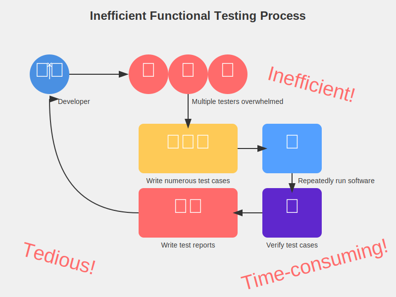

Each step in this process is very time-consuming and tedious, with a high likelihood of oversights during actual operation. Large teams can allocate sufficient resources to deploy a large workforce for testing or outsource the entire testing work to third parties.

However, to seize market opportunities, software products often iterate very quickly, and many small and medium-sized software companies focus their main resources on new product development, often lacking enough testers to support new feature testing. As a result, some small and medium-sized companies, in order to ensure product launch speed, can only ignore the importance of E2E Testing, or have other personnel double as testers, simplifying or even omitting some steps, leading to a decline in product quality.

If there were a tool that could make E2E Testing as automated and low-cost as possible, it would be very attractive to small and medium-sized teams.

## 1.3 Our solution and USP

Although there are already some testing tools on the market that achieve a certain level of automated E2E Testing capabilities, there is still significant room for improvement overall.

The most common solution is to have testers write certain test scripts. Testing tools can control interface operations by reading these scripts. Then, the testing tools repeatedly run these scripts automatically to perform "functional detection." However, this makes script writing a bottleneck. Requiring testers to write script code greatly increases their workload, and different testing tools have different scripts, making these skills not universally applicable. After investing a lot of effort in training testers, changing to a different testing tool might require relearning. Subsequently, some low-code testing tools have emerged that can accelerate script writing through methods like "recording," but they still require testers to manually operate once to form a script. The problem is that software products change very quickly, and scripts that took a lot of time to record previously may need batch modifications due to a button change, often causing testers to lack the energy to modify previous scripts. In other words, if testing resources are insufficient, scripts can easily become outdated and abandoned. Finally, these testing tools can be quite complex and expensive, requiring complementary project management software to use, and even learning how to use them may require specialized personnel training, which is often difficult for general small and medium-sized enterprises to afford.

To enable small and medium-sized software companies with insufficient testing resources to easily perform good E2E Testing, the most important thing is to use automated tools to help testers automatically write test cases, generate scripts, and automatically maintain these scripts. This allows all aspects of E2E Testing to be automated.

Then, regarding writing test cases for software functions and interfaces, testers still need to read product documentation themselves, understand the content, and manually write, and currently there are no relevant tools to reduce this part of the work.

Now, with the rapid development of AI large language models (hereinafter referred to as LLM), there is a better solution direction for this previously under-researched problem. Based on the founders' years of cooperation experience with various scales of product research teams, Cyberbard has collected a large amount of industry data related to testing and plans to train a specialized LLM for E2E Testing personnel: Cyberbard Testing LLM (hereinafter referred to as CT-LLM). Testers only need to provide a simple description of the newly added features using natural language, and our platform can automatically break down product details, write test cases, generate test scripts, and then automatically run these scripts. What testers need to do is review these scripts and then wait for the system's final test report. When the product changes, our CT-LLM will also automatically modify related scripts, avoiding repetitive labor for testers.

The optimized process is as follows:

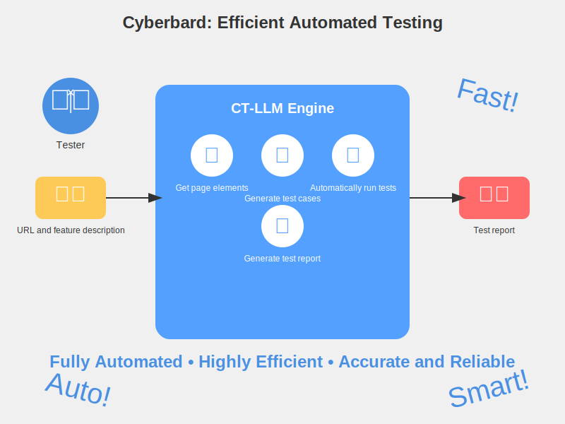

As can be seen, the new process greatly reduces the workload of testers. In summary, Cyberbard, through CT-LLM, has automated the most time-consuming parts of "E2E Testing" - "writing test cases" and "generating scripts," further increasing the automation level of the testing process. This way, the lack of testing human resources and concerns about software quality no longer become obstacles to the development of small and medium-sized software companies. Product research teams can focus on iterating new products and ensure software quality at a lower cost.

## 1.4 Feasibility Study

### 1.4.1 Market Feasibility

According to GMI's forecast, the global software testing industry will maintain a 7% annual growth rate in the next 10 years, and the market size of application testing automation is expected to exceed $97.3 billion by the end of 2032. Among them, the proportion of small and micro enterprises reaches 95%. According to a report by Statista, 25.60% of small businesses have less than 10% of their staff as testers, and 26.2% of small businesses allocate less than 10% of their budget to testing. This indicates that many small and medium-sized software enterprises need new automation tools to compensate for insufficient testing resources.

Currently, Cyberbard's official website has launched a waiting list, where visitors can fill in their email addresses online to get the latest news. Over 1,000 testers are willing to try our product as soon as possible, we have over 1,000 followers on our official social media, and the introductory blog on our official website has been read by over 10,000 people. At the same time, 10 companies have signed initial intention contracts with us. Many potential users have expressed that they are looking forward to tools that can help them save testing costs.

### 1.4.2 Technical feasibility

Currently, tools for training specialized models based on general large models are quite mature, with many open-source tools provided for free. We are considering using open-source large models like LLaMA to save costs, only requiring ordinary but related data on E2E Testing, which is still relatively scarce. It is estimated that training CT-LLM will take some time, with plans to complete training in half a year. Automated testing tools are also quite mature, and can be modified based on open-source tools like Selenium to accelerate MVP development progress and obtain user feedback as early as possible.

Some technical verification work has already begun, with plans to successfully train CT-LLM in half a year and provide an MVP within a year, which can provide services to a small range of early adopters and optimize based on user feedback. In the second year, we will gradually increase the planned capabilities, launching the first public paid version in Q1, providing the most basic functions, including AI test case generation, management backend, and membership billing. In terms of platform compatibility, we will first support testing for Web platform applications, which have a larger number of developers. In the third year, while accelerating commercialization, we will also invest more in research and development to continue improving the system.

Overall, our self-trained CT-LLM is our product's moat. As time increases, the performance of CT-LLM will continuously improve, always maintaining our industry-leading advantage.

### 1.4.3 Financial feasibility

The main startup funding for this project comes from the founder's own savings of £150,000. The main work in Year 1 is planned to be MVP development, with the main R&D personnel being the founder himself. The main expenditure in Year 1 is also related to R&D personnel wages, LLM training data, and hardware-related expenses for training the AI engine. The planned R&D expenses are £69,000, accounting for 85% of total expenses. In Year 2, after the official version is launched, we will begin to expand marketing activities, with marketing-related expenses accounting for 22% of total expenses. We plan to develop over 600 paid users throughout the year, with revenue exceeding £250,000. At the same time, we plan to reach the break-even point (BEP) in the second year. Starting from the third year, we will increase the number of R&D and sales personnel, entering a stage of rapid expansion and increased profitability. Marketing expenses will increase to 26% of the total, with sales revenue breaking through £1 million. Overall, the initial investment funds plus subsequent income can cover the usage needs throughout the research and development and expansion stages.

# 2 COMPANY DETAILS

## 2.1 Why Choose the UK?

The UK government's strong focus on AI and technological innovation, along with related policies and financial support, such as the "Industrial Strategy: Artificial Intelligence Sector Deal", provides significant development opportunities for AI startups. The UK has a stable and transparent legal system that protects intellectual property and supports technological innovation.

Software testing companies in the UK are still predominantly traditional large enterprises, inclined to serve large corporations and set industry standards. Meanwhile, some high-tech companies in Silicon Valley, USA, have already begun researching and using the latest AI technologies to transform the software testing industry, such as Datadog and Katalon. This area still has substantial market development potential in the UK.

Therefore, Cyberbard's choice to operate in the UK allows us to leverage the stable market environment for long-term business development while filling a gap in the local industry. It also enables us to serve the local UK market as a foundation and provide more international competitiveness for the UK software services industry.

## 2.2 Why London?

London is a world-renowned city, chosen as our company's operational headquarters primarily due to its concentration of rich professional talent resources. The city is home to numerous prestigious universities and research institutions, attracting a large number of high-quality graduates and industry experts in artificial intelligence, data science, and engineering technology from around the world, providing strong talent support for the company. Additionally, as one of the global financial centers, London offers numerous incubators, accelerators, and startup communities, providing ample financing channels and investment opportunities for startups.

Compared to other cities, London offers a variety of office space options for startups, allowing for a professional, globally-oriented image at a relatively low cost. The local government provides a series of startup-friendly policy supports, such as tax relief and startup subsidies, which help reduce operational costs and enhance business competitiveness.

As a company serving businesses, Cyberbard's location is also a key market for us. London's position at the center of key markets, with its large number of startup software companies, brings us closer to our main customers and partners, facilitating business operations and relationship building. We can quickly respond to and meet market demands, whether local or in surrounding areas.

London is also known for its livable quality of life and its diverse, international character, making it a convergence point for global talent. This aligns perfectly with our business philosophy, as we are committed to providing more opportunities for global AI talent to develop in London.

# 3 Production and Services

## 3.1 Cyberbard Target Clients

Cyberbard primarily targets small and medium-sized software companies and enterprises. In the initial business expansion phase, the main focus is on exploring the demands of the UK local software industry. London and its surrounding urban areas, where the company is located, already have a large number of small and medium-sized software development enterprises. We plan to increase our influence in the UK local testing industry, develop our first batch of customers, and validate our business model by participating in local forums and exhibitions, scheduling offline meetings, and utilizing local social media. This will lay the foundation for serving global users in the future.

Specifically, these enterprises typically have the following characteristics:

- Employee size generally does not exceed 20 people. These companies are relatively small with limited internal resources, especially in terms of personnel allocation in technology and testing areas.
- Annual revenue usually does not exceed £2 million, but they have relatively stable customer sources and income levels. Although there are limitations in investing in expensive testing fees, there is a need to further improve software quality.
- Industry sectors mainly focus on software development, SaaS, web application development, and other technology-driven industries. These enterprises typically specialize in developing innovative software products for specific markets. They often need to rapidly develop products to seize market share, leaving less time and resources for testing.

These types of enterprises frequently face the following testing challenges:

- Lack of testing resources: Due to financial and personnel constraints, these enterprises often lack dedicated testing teams. Developers need to share testing tasks, which not only affects development efficiency but may also lead to lower testing quality.
- Long testing cycles: Traditional manual testing or semi-automated testing methods are time-consuming, easily leading to extended product iteration cycles and missed market opportunities.
- Inconsistent testing quality: Due to the lack of systematic testing methods and tools, test coverage is insufficient and testing depth is inadequate, potentially resulting in numerous bugs and potential risks in the product.
- Pressure for technological upgrades: Facing rapidly changing market environments, these enterprises need to frequently update and iterate product features. However, due to imperfect testing processes, it's often difficult to release new versions quickly while ensuring quality.

The main goals of these SMEs are to accelerate product time-to-market, improve product quality, and optimize development and testing processes to maintain advantages in a competitive market. Specifically:

- Reduce development and testing costs: They hope to reduce manual testing needs by introducing automated testing tools, thereby lowering labor and time costs.
- Improve product quality: Through more comprehensive and efficient testing methods, reduce the number of bugs after product release, enhancing user satisfaction and brand reputation.
- Accelerate product iteration: They hope to shorten testing cycles to respond more quickly to market demands, achieving frequent version updates and seizing market opportunities.

In these enterprises, due to the small company size, purchasing decisions may be made jointly by the CTO and CEO. Therefore, on one hand, Cyberbard needs to have certain technological innovations to make the CTO feel its unique technical value, while also being clear and intuitive in use, allowing the CEO to have a direct experience of the convenience of our platform.

## 3.2 How Cyberbard works

In recent years, applications have become an indispensable part of our daily lives, with millions of apps available for use on phones or computers. As the importance of applications in our daily lives increases, it becomes increasingly critical for application developers to ensure their apps are of high quality and perform as expected for users.

Software testing can typically be divided into three types: unit testing, integration testing, and E2E Testing. The first two types of testing are closely related to developers, and there are already some tools to reduce costs. However, E2E Testing still requires professional testers to execute and complete, as shown in the following diagram:

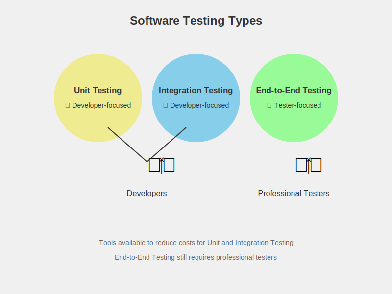

The main process of E2E Testing consists of the following steps:

- First, it's necessary to communicate fully with product managers and developers to understand every detail of the product;
- Then, based on the details grasped, test cases need to be written, with each case representing a possible operation of a type of user. If there are omissions, it may lead to a decrease in software quality;
- According to the test cases, write test scripts or perform manual testing directly to verify each test case.
- Testers record the passing status of test cases, feed back the operation paths of problematic cases to developers for modification, and verify the modification results.

Existing automated testing tools cannot complete the above process. The goal of our automated tool is to fully automate the above process, improving the efficiency of testers.
Here's a simple example to illustrate the basic operation of Cyberbard. Let's say our product is a website, and assume this website previously did not support user login, but now a new feature has been added: logging into the website via Google.

In the traditional process, testers first need to understand the product requirements and manually write test cases for this new feature. The tester might add the following 4 test cases:

- Whether the login is normal when the user's browser is already logged into a Google account.
- Whether the login is normal when there is no Google account logged in in the user's browser.
- Whether the error prompt is displayed correctly when the user refuses to authorize Google account login.
- Whether the error prompt is displayed correctly during the login process under unstable network conditions.
  
It's evident that the workload of testers increases accordingly. Not only do they need to test these 4 new cases, but the previously related interfaces that added the "Login" button may also need to be regression tested to ensure other functionalities are not affected. This process is very consuming in terms of human and material resources, and it basically relies on manual writing of test cases, which places high demands on testers and can easily lead to situations where test cases fail to provide comprehensive coverage, meaning important errors and issues might be missed.

If using the Cyberbard platform, testers only need to prepare product documentation and some simple interactions, and the above steps can be automatically completed through the platform's CT-LLM. Below are detailed explanations of the specific steps and DEMO screenshots.

First, open the platform's user backend, where you can see the testing status of all projects

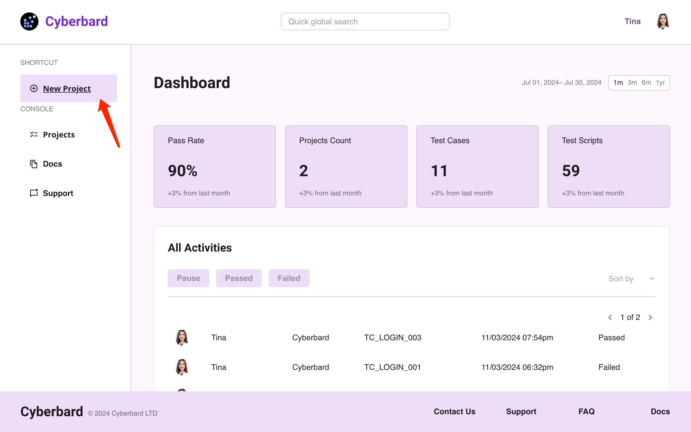

Suppose we have a new project to test, first create a new project. Each project corresponds to a software. If it's a website, enter a URL here.

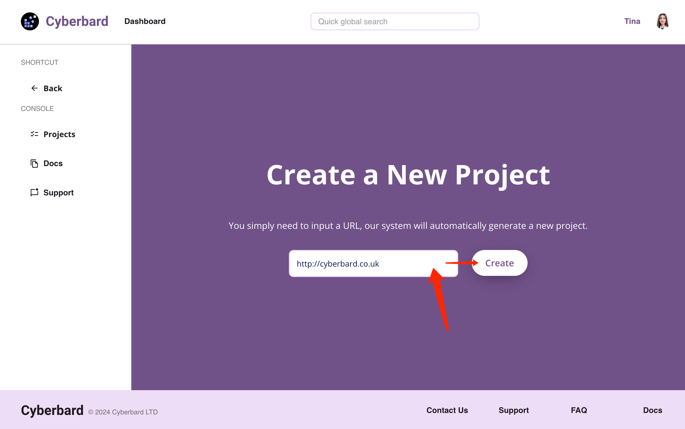

Then, you need to create a new version, so that different versions correspond to different features, facilitating future project version management. This interface is quite important. First, you need to input some materials to allow the system to automatically infer which features need to be tested in this version. In the DEMO, the "product documentation" for the new feature was uploaded, and of course, you can also upload "product user manuals" at the same time. In short, the more documents, the more conducive it is for the platform's AI engine to infer more comprehensive test cases. Then, you can describe the key features that need to be tested in natural language, which is optional; if not written, a comprehensive test will be conducted. Finally, write a version number (e.g., 3.2), and the system will start inferring "test cases".

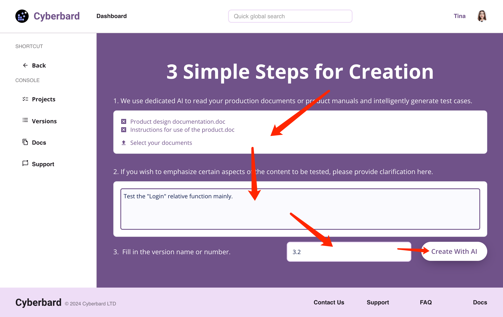

Below is the system's automatic inference interface. Cyberbard will access the relevant interfaces based on the software entry point (URL) input earlier, collect the interaction elements and text within, and combine them with the documents uploaded in the previous step as materials to infer the test cases for the entire functionality and predict the click path needed for each test case.

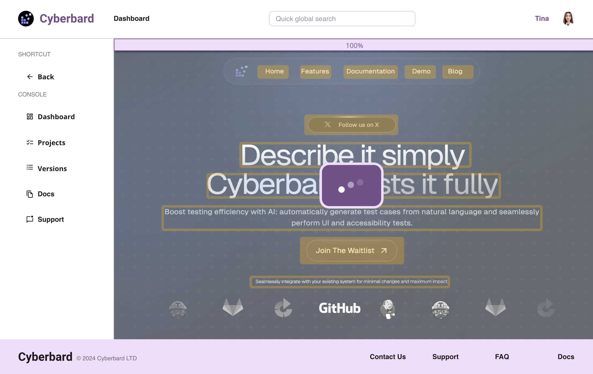

After everything is completed, the following interface will appear, listing all the test cases inferred by the engine.

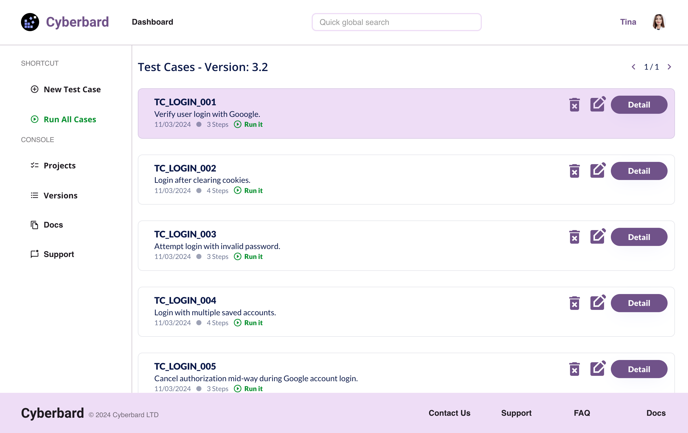

Testers can click here to enter each test case to view the automatically generated test steps and test result judgment conditions. The left side of the interface shows the operation steps for each test case, and the right side shows the interface interaction elements involved in each step (buttons and text, etc., marked in green).

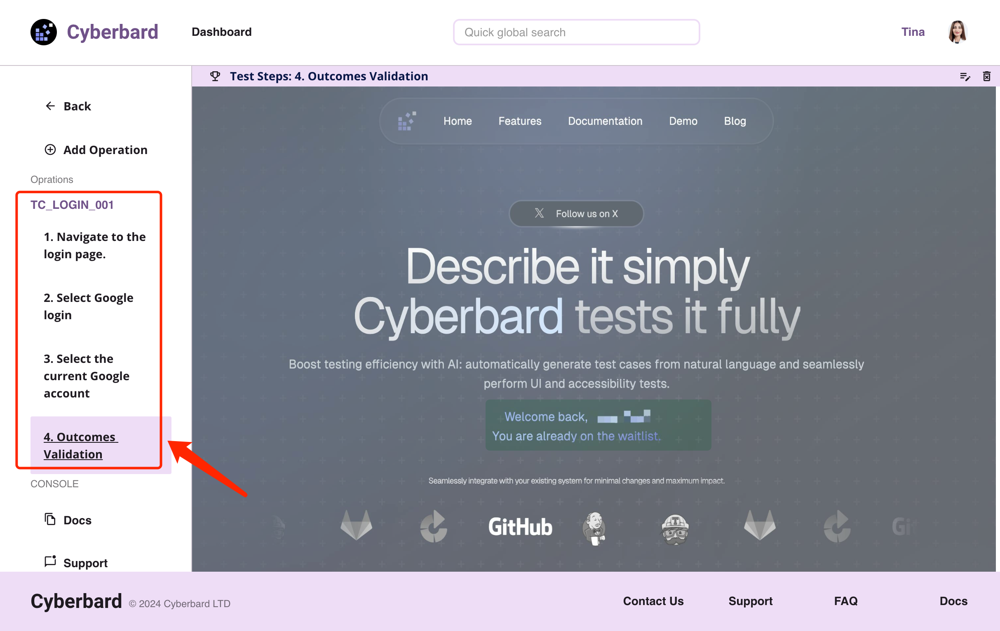

After checking that there are no problems, you can return to the list page and click the green button "Run All Cases" on the right. The system will automatically run all test cases. Testers only need to wait for the completion email of the final test report.

From this example, it can be seen that the Cyberbard platform exceeds the capabilities of most existing platforms, achieving full process automation at the E2E Testing level, basically replacing most manual work, and potentially achieving higher test coverage than traditional manual methods. To automatically complete tasks, the entire platform uses many new technologies and methods. For example, Optical Character Recognition (OCR) technology is needed to recognize text on software interfaces, and Robotic Process Automation (RPA) technology is required to automatically manipulate software to run test cases. However, the most core and important capability is the need to complete the derivation of "test cases". Currently, few teams have research in this area, which is also the innovation point of this product. Later chapters will detail how we conceived this and which aspects are used to break through the limitations of existing technology to achieve human-like "test case" reasoning capabilities.

## 3.3 Revenue Model with Pricing Structure

Based on market research and competitor analysis, Cyberbard's revenue model will adopt a tiered subscription model (Freemium Model) to balance user growth and revenue growth. It specifically includes two main revenue sources: free users and subscription users.

### Freemium

- Objective: Attract a large number of users to use our platform and gradually guide users to upgrade to paid versions through the usage process.
Usage restrictions:
- Personnel: Unable to share projects with others.
Test count limit: Free users can run a certain number of tests per month, for example, 100 times.
Concurrent test quantity: Limit the number of simultaneously running test tasks, for example, a maximum of 2.
- Test duration: Limit the maximum runtime for each test, for example, 30 minutes.
Feature limitations: Free users cannot use advanced features such as complex integration tests, cross-platform tests, and AI optimization functions.
Storage limitation: Limit the historical records of test results, such as only saving the test results from the most recent month.
- Revenue source: Although free users themselves do not generate direct revenue, they can be prompted to upgrade to paid versions to remove limitations.

### Paid Subscriptions

Divided into three tiers: Starter, Basic, and Pro versions, providing more comprehensive features and support.

#### Start Plan

- Monthly fee: £59/person/month.
- Personnel: Limited to 1-2 people sharing the same project.
- Features: Provides basic automated testing functions, no limitations on test - counts or concurrent quantities, but may still have certain restrictions on test duration, such as a maximum of 2 hours per test. 1 project.
- Support: Provides community forum support.

#### Basic Plan

- Monthly fee: £99/person/month.
- Personnel: Limited to 1-10 people sharing the same project.
- Features: Provides basic automated testing functions, no limitations on test counts or concurrent quantities, 1-10 projects. Provides API integration services for easy integration into existing software processes.
- Support: Provides email support, but does not include phone or real-time chat support. Replies within 48 hours on working days.

#### Pro Plan

- Monthly fee: £199/person/month.
- Personnel: No limit on the number of people sharing the same project.
- Features: No usage restrictions, fully unlocks all platform features, including AI optimization, complex integration testing, cross-platform testing, etc.
- Support: Provides priority support, including real-time chat support. Replies within 24 hours on working days.
- API access: Allows integration of platform APIs for remote management and triggering of automated test scripts.

### Future Outlook

Our pricing plans mainly serve small and medium-sized enterprises and teams, hoping to help more teams with a lower threshold. As the user base expands and platform features improve, the revenue model will also be gradually optimized. We plan to gradually introduce more targeted subscription packages in the future based on market demand, and explore new revenue sources, such as allowing third-party developers to sell plugins and services on our platform. In short, this revenue model aims to attract a large number of free users and gradually convert them into paid users, while opening up paid API capabilities to facilitate user self-integration into other systems, thereby achieving sustainable business growth.

# 4 Technology

## 4.1 System Architecture Overview

<!-- Overview of the system architecture. Include an architecture diagram and detailed explanations to complement the diagram -->
To make product development more efficient, Cyberbard uses currently mature technologies and frameworks as much as possible to achieve the expected capabilities, and concentrates research and development resources on the core part "Testing Domain-specific AI Inference Engine (CT-LLM)". The goal is to quickly develop prototype products using fewer resources, actively collect user feedback, continuously adjust product details, and get closer to user needs. The framework of the entire platform is shown in the following diagram:

### Foundation Layer

The blue part at the bottom is the foundation layer. This includes some of the most basic infrastructure. The computing platform can provide GPU computing resources for the AI engine. Container orchestration capabilities can manage and deploy containerized test environments, allowing the entire platform to run stably on the internet. Load balancing ensures smooth platform usage even when a large number of users access it. Data security capabilities protect the safety of user test data and results. The logging system is used to record system operation and user execution logs, facilitating troubleshooting and backtracking of issues during operation.

### Service Layer

The green part above is the service layer. The most important component here is CT-LLM, which uses AI technology to assist in the testing process, such as generating test cases and optimizing test strategies. This is also the key part of our platform, and the basic structure will be described in detail in later sections. Authentication service handles user authentication and authorization. Task scheduling service manages and schedules the execution of test tasks, allowing pre-set tasks to run repeatedly as configured. The automated testing framework provides underlying automated testing support, with plans to support Web applications in the first phase, using a built-in browser engine to verify test cases. RPA service, deep learning, and OCR service all use mature open-source frameworks to simulate user operations, automatically find interactive elements on web pages, and save them for use by other modules.

### Application Layer

The orange part is the application layer. Each major function actually used by users corresponds to an independent application. User management, test data management, test project management, and test report generator are all necessary capabilities for user operations. The "test script generator" and "test case generator" capabilities rely on CT-LLM and are the most important applications here. Their effectiveness directly affects the usability of the entire system. Finally, the "test script editor" includes the ability for users to manually adjust some details, which is quite necessary. As AI capabilities improve, the parts that need manual adjustment will gradually decrease. The "script executor" is the final capability to execute automated tests on the software interface. There are already some mature open-source solutions in the industry, such as Selenium, and this product plans to directly inherit some of their capabilities.

### Deployment Methods

The first phase will provide SaaS services, facilitating quick user access and usage. The second phase will support CI/CD integration, facilitating integration with other systems such as Github, GitLab, Bamboo, Jenkins, etc. This way, users can seamlessly switch to our system without leaving their familiar environment and systems. In the future, we will support local deployment, allowing deployment in users' private environments for enhanced security and control. We also plan to support software testing on more platforms and abstract existing capabilities into APIs, providing them to advanced users for self-integration into their own systems. We focus on providing core capabilities related to E2E Testing.

# 5 Innovation - AI System Design and Implementation

As previously mentioned, the most critical component of the entire system is Cyberbard’s proprietary **CT-LLM**. This chapter will provide a detailed explanation of our design thinking and implementation approach, showcasing how we innovatively integrate AI technology into the automation of **E2E Testing**.

## 5.1 Core AI Model and Fine-Tuning for Software Testing

To enable **E2E Testing** automation, the first challenge is to automate the process of deciding what needs to be tested and determining whether a particular function has been successfully tested, returning results of pass or fail. Traditionally, these steps require manual definition by test engineers. With the advancement of technology, new methods have emerged to reduce the cost of each stage. Currently, the industry has begun employing deep learning (DL) and reinforcement learning (RL) technologies for automated testing. By learning from the behavior of human testers, these methods aim to generate human-like actions and interactions to more comprehensively and effectively test the functionalities of an application. The underlying assumption is that the closer the testing algorithm's actions are to those of a real user, the more comprehensive and effective the testing will be. However, there are still limitations to **E2E Testing** methods based on DL or RL.

- **Data Requirements**: These algorithms require large amounts of training data, which are often difficult to collect from real-world user interactions. Modern applications are complex and dynamic, potentially involving dozens or even hundreds of different pages, each with its own unique set of interactions and possible user behaviors and logic. Additionally, the test inputs generated by these methods often differ significantly from real user interactions, leading to lower test coverage.
- **Generalization Issues**: These algorithms are designed to learn and predict from training data, but they may struggle to generalize effectively to new, unseen situations, especially since applications are continuously evolving and updating.
- **Non-determinism in Applications**: Applications may exhibit non-deterministic behavior, meaning that the outcome of the same action might vary across executions (e.g., clicking a "delete" button in a list of items will result in an empty list after the last item is removed, at which point the delete button no longer functions). This makes it particularly difficult for RL algorithms to learn and make accurate predictions.

Given these limitations, there is a pressing need for a more effective method to generate human-like actions that can comprehensively test a wide range of applications. **Large Language Models (LLMs)**, such as GPT-3/4, have proven to be powerful tools for natural language understanding and question-answering tasks. Recent advancements in LLMs have spurred various research efforts exploring their use in software development tasks. OpenAI’s **ChatGPT** (a generative pre-trained transformer based on conversational interaction) boasts billions of parameters and has been trained on extensive datasets, including testing scripts and bug reports. Its remarkable performance across multiple domains showcases the ability of LLMs to understand human knowledge and interact as knowledgeable experts in various fields. Inspired by ChatGPT, we propose the **Cyberbard** solution, transforming the **E2E Testing** challenge into a question-and-answer (Q&A) task, where the LLM plays the role of a human tester to test the target application. The key challenge in our implementation lies in developing a specialized domain-specific LLM proficient in reasoning about testing use cases and other testing-related tasks, i.e., the previously mentioned **CT-LLM**.

### The Necessity of a Specialized Model

Why is a domain-specific large model for testing necessary, even when general-purpose large models provide basic service capabilities? Let’s take an analogy: a general-purpose large model is like an abstract concept of a vehicle, representing general capabilities without being a specific type of vehicle. Vehicles like airplanes, ships, and cars all transport goods, but each has its own characteristics. If the goods need to be delivered to a location along the highway, a car would be the most appropriate.

The domain-specific data in the field of testing, especially for "software testing" as it relates to our product, is extensive and specialized, making it difficult for a general-purpose large model to cover comprehensively. The diagram below illustrates the overall structure of **CT-LLM**:

### Data Layer

Includes data from the software testing domain and general domains. These provide the foundational data support for large model training and optimization. For Cyberbard, software testing domain data is crucial and is an important distinguishing factor from other products. Currently, most products in the market are researching "unit testing" data related to code, with very little data on E2E Testing for training. This is because unit testing only requires inputting code and returning code, which is a one-time text-to-text input and relatively easy. However, E2E Testing requires correlating variable graphical interfaces and multiple operational steps, making it difficult to map into a dialogue structure suitable for LLMs. To address this issue, we will first extensively screen the required types of test data, such as product specification documents, test case documents, etc., aiming to cover various software types.
At the same time, we will also incorporate some general data to maintain the inherent capabilities of the base model in general domains without causing issues.

### Data Engineering Layer

Includes data construction, data selection, and data usage. This layer ensures high quality and applicability of data, providing good conditions for large model training. This work is also very important and will be continuously improved. The accumulated unique and excellent test industry fine-tuning data will become our moat, ensuring the ultimate performance of our product and making it difficult for competitors to surpass.

The effectiveness of the subsequent steps mainly depends on the quality of the input parameters, that is, the quality of the data prepared here. Currently, there are no large models specifically fine-tuned for E2E Testing. For better fine-tuning results, we have designed a structure that maps software interface elements and operations into a multi-round dialogue form, creating training data, validation data, and test data. Currently, the data sources are self-generated test cases and publicly available test case data online.

The E2E Testing set should include:

- Software interface description: Including page information on the interface, detailed information on text, buttons, input boxes, and other controls.
- Corresponding high-quality test cases: Complete test cases written by professional testers.
- Corresponding high-quality test scripts: Complete test scripts written by professional testers.

The final fine-tuning data structure can be of two types:
Generating test cases:

- Input: Software interface description
- Output: Corresponding test cases

Generating test scripts:

- Input: Corresponding test cases
- Output: Corresponding test scripts

To obtain sufficiently diverse data, we should collect interface and test case data from different types of software, including software interfaces and product interaction data from various industries. Ideally, the dataset should contain at least several thousand such sample pairs.

This process is also known as "data construction". Collecting corpora is simple, but writing high-quality fine-tuning data structures based on these corpora is extremely difficult and cost-uncontrollable. Currently, considering only model fine-tuning, the common methods for constructing fine-tuning data broadly include manual annotation and formatting existing datasets. Common methods in formatting existing datasets include Self-Instruction and Self-QA. Self-Instruction refers to using large models like GPT-4 to generate more fine-tuning data based on pre-written seed instructions. If there is no seed data available, the Self-QA method can be used to generate fine-tuning data directly from unstructured documents. To ensure that all test data is effective and carefully selected, manual annotation is the best production method. We may manually annotate these documents ourselves and convert them into usable data structures. When necessary, such as when there is insufficient data, we will write documents and produce some data ourselves based on different software types. To control costs, we plan to combine both methods to improve annotation efficiency.

After constructing the fine-tuning data, "data selection" is needed. Data selection involves choosing the most suitable data subset from the fine-tuning data as the final training dataset. In data selection, the current common practice is to first perform data deduplication, and then use the Nuggets method to select the optimal dataset. This method has three inputs: a large model to evaluate data quality; a Predefined Task Set to assist in evaluating data quality; and an Instruction Set, which is the large dataset waiting to be screened. The output goal is an excellent subset of the Instruction Set, called the Golden Set. It believes that if a piece of data serves as the one-shot in that shot, i.e., as an example for reference, and can significantly improve the large model's performance compared to zero-shot, it is considered high-quality data.

The main work of "data usage" is to ensure the adjustment of data proportions during training and iteration, further optimizing data based on actual situations, and preventing catastrophic forgetting.

### Large Model Layer

This layer is the key capability module for platform implementation, equivalent to the brain of the system. Through learning and optimization in this layer, raw data forms the ability to generate test cases and test scripts for various software interfaces.

#### Base Model

Choosing a suitable base model for CT-LLM is essential. Without good general knowledge, it will be difficult to achieve the expected goals with later fine-tuning of professional data. It's like an illiterate person who can't read or write; no matter how much professional knowledge you teach them, they won't be able to learn. When choosing a base model for vertical domain fine-tuning, multiple factors need to be comprehensively considered, including model performance, scale, community support and documentation, scalability and compatibility, applicability of training data, training and inference efficiency, security, and cost.

Considering the characteristics of the testing industry, our requirements will focus on the ability to understand grammar in text relatively well and have strong reasoning capabilities. Currently, the top-ranked open-source LLM engines generally meet our requirements. For example, ChatGLM3-6B-Base has sufficient pre-training data, a good development community and expansion capabilities, commercial authorization, and integrates well with existing development frameworks. The specific choice still needs further comparative evaluation to determine.

After selecting the base model, the next step is to fine-tune it. Different professional scenarios have different requirements; for example, some require new and large amounts of information, while others require the ability to output sentences in a specific style. Different requirements also lead to different technology selections. Generally speaking, there are three ways to improve capabilities in a specific professional field: prompt engineering, RAG, and fine-tuning.

- Prompt engineering is relatively simple to use, flexible, and low-cost, but it is highly dependent on the base large model and has uncertain effects for highly specialized information.
- The RAG method has the advantage of being able to integrate the latest external information for output at any time, suitable for information organization and quick indexing, but not suitable for overall modification of the model's style and inference capabilities.
- The fine-tuning method is suitable for situations that require integrating domain knowledge for reasoning. Although training is relatively complex, it is more suitable for our product.

There are now many different fine-tuning methods. Based on the E2E Testing domain, where proprietary data is not abundant, and we still hope to retain the reasoning ability of the base model as much as possible, the LoRA method of fine-tuning is our preferred solution, with other methods used as supplements. On one hand, it performs very well in small data scenarios, and on the other hand, it uses less memory during training and has faster training times. Especially in new fields where new training data will be continuously supplemented to improve model performance, full parameter adjustment is too inefficient. LoRA fine-tuning allows our product performance to iterate more quickly, adapting to market changes.

In the process of building a domain-specific large model, the complete process generally includes continued pre-training, supervised fine-tuning, alignment fine-tuning, and reinforcement learning from human feedback.
Continued pre-training requires a large corpus, which is not suitable for the E2E Testing scenario. According to practice, generally speaking, "supervised fine-tuning" plus "alignment fine-tuning" can achieve a relatively good performance. The following mainly describes the implementation of the fine-tuning solution.

#### Fine-tuning Model

Currently, the main popular fine-tuning methods include Lora (Low-Rank Adaptation) and Prompt Tuning v2. LoRA is a method of fine-tuning pre-trained models by introducing low-rank matrices. It performs a low-rank approximation of some parameters in the pre-trained model (usually the projection matrices in attention layers), thereby significantly reducing the number of parameters during fine-tuning. This method allows efficient fine-tuning of large models without adjusting all of the model's parameters. At the same time, the advantage of LoRA is that it does not change the structure of the original model, and by introducing low-rank matrices, it only needs to save additional parameter matrices rather than the entire model parameters. Therefore, it is a very effective parameter-efficient fine-tuning method. So, Lora is more suitable for the requirements of this product at the current stage.

In the fine-tuning process of large-scale language models (LLMs), the LoRA (Low-Rank Adaptation of LLM) algorithm is a very effective technique. LoRA reduces the number of model parameters while maintaining high performance by constraining the fine-tuning process of the original weight matrix to a low-rank subspace. As shown in the figure, the core idea of LoRA is to approximate the original weight matrix through the product of two small matrices W(a) and W(b), significantly reducing the number of parameters in this way.
The effectiveness of LoRA mainly comes from the following two aspects:

- **Low-rank approximation**: In actual large-scale neural networks, changes in weight matrices are usually low-rank, meaning these changes can be effectively expressed with a small amount of information. Low-rank approximation takes advantage of this by limiting the rank of the matrix, reducing the number of parameters while retaining the main change information.

- **Optimization process**: Since W(a) and W(b) are both small matrices, optimizing these two matrices requires fewer computational resources compared to directly fine-tuning the complete weight matrix. Moreover, since fine-tuning is performed in a low-rank subspace, this also helps prevent overfitting and maintains the model's generalization ability.

The left side of the above figure is a certain layer in a traditional LLM model. LLM contains many layers, and each layer also includes experiments that can be found. LoRA is usually used in the self-attention mechanism of the Transformer model during model fine-tuning, especially in the query W(q) and value W(v), sometimes also in the key W(k). There are several reasons behind this choice, mainly involving model efficiency, the role of specific layers, and the impact on final performance, specifically in the following aspects:

- Parameter efficiency: Fine-tuning focuses on the parts that can most influence model output and performance. W(q) and W(v) directly affect the calculation of attention weights and the final output representation, so adjustments to these layers can more directly change the model's behavior.
- Influence on information selection: By adjusting W(q), the model's method of selecting information can be influenced (i.e., what information it "pays attention to"), and by adjusting W(v), how the model utilizes this information once it's selected can be influenced. W(k) mainly affects the way information is matched, and in many cases, adjusting W(q) and W(v) is sufficient to guide the model to focus on more useful information.
- Computational efficiency: Although the purpose of LoRA is to improve parameter efficiency through low-rank updates, applying this update to all layers would still increase additional computational burden. Therefore, selecting layers from the middle that have the greatest impact on final performance for adjustment can achieve the maximum performance improvement while adding minimal computational cost.
- Experiments and experience: Experience and research in practical applications show that applying LoRA fine-tuning on Q and V layers can usually effectively improve performance for specific tasks. This may be because these layers play a key role in the model and have a greater impact on the output.

#### Reward Model Training

To further improve the quality of generated test cases, we can train a reward model to evaluate the generated test cases. This process includes:

- Training the reward model: This is our main approach, using most of the collected scoring data and our proprietary algorithm to predict the quality scores of test cases.
- Collecting manual scoring data: As a supplementary means to improve accuracy, have test experts score a portion of the generated test cases. Scoring criteria can include coverage, executability, effectiveness, etc.
- Reinforcement learning fine-tuning: Use the trained reward model to guide further optimization of the main model, encouraging the generation of high-quality test cases.

### Evaluation Layer

Each layer has corresponding evaluation requirements. The data layer mainly focuses on assessing data quality, while the data engineering layer evaluates data proportions and training data. The large model layer includes test domain and general evaluation sets, and we will also build our own evaluation sets. Evaluating application effects requires clarifying business benefits and business results. Through comprehensive evaluation, we ensure the effectiveness and reliability of the large model in practical applications.

To assess the model's performance, we can design the following evaluation plan:

- Automated metrics:

BLEU score: Compare the similarity between generated test cases and manually written test cases.
Coverage analysis: Evaluate the coverage of generated test cases for software functionality.
Grammatical correctness: Check if the generated test cases are grammatically correct.

- Manual evaluation:

Executability: Testers attempt to execute the generated test cases and evaluate their executability.
Effectiveness: Assess whether the test cases can discover potential software defects.
Innovativeness: Evaluate whether the model can generate some test scenarios that human testers might overlook.

- Practical application testing:

Use the model in real software testing projects, comparing testing efficiency and defect detection rates before and after using the model.

## 5.2 Automatic Testing With AI

After training the CT-LLM through the steps outlined above, combined with the platform's other services and modules, the automation of E2E Testing can be achieved. The specific process is illustrated in the diagram below:

Cyberbard executes each test case through two iterative loops, continuously running until the entire E2E Testing process is completed.

First, in the inner loop, the system's primary task is to identify the next feature to be tested in the E2E Testing process. It then breaks down the feature into individual test cases, executing one test case at a time, until all features are covered, at which point the loop ends. Our key approach involves building a "Test State Memory" that records all detailed interaction testing information, such as explored pages and controls. During this process, the memory also stores progress at the functional level, such as which feature is currently being tested. This is achieved through a loop that queries the "dedicated engine" for precise reasoning. It is important to note that the "context information" in the diagram includes not only the UI information passed from the outer loop and the records of each test, but also completed portions and initial functional hints described in natural language by the tester. We also designed a prompt language template, allowing this "context information" to be input into the "dedicated engine" in a fixed format each time, enabling it to retain knowledge of the entire test and perform long-term reasoning.

Next, the outer loop's main purpose is to complete a test case by inferring the necessary steps. To do so, the system must interact with the "software under test," which requires collaboration with other services. First, OCR technology is used to scan the software interface and extract the UI context information of the current UI page. This approach allows the system to operate without needing to focus on the specific framework of the "software under test," nor does it require access to the software’s code. It closely mimics the work of a software tester. The next step is to encode the extracted UI elements into a prompt for the "dedicated engine" using a pre-designed template, and then verify the feedback for the next step. If unsuccessful, the system provides new feedback; if successful, it executes the test script contained in the feedback response. PRA is used to control the interface of the "software under test" and automatically execute the script. This process continues in a loop until the current test case is completed, after which it waits for the next instruction from the "inner loop."

This iterative process ensures that the entire functionality of the "software under test" is progressively covered. The initial execution may take longer, but as the software is upgraded, the system prioritizes reasoning on newly scanned UI elements based on historical data. It also rescans older related elements, and if it determines that there are impacts on previous functionality, it automatically re-executes the relevant loops. Changes are then recorded in the corresponding "test cases" and "test scripts." This entire process requires minimal involvement from the testing personnel, who only need to review the generated test report in the end.

## 5.3 The Final Production Technology Pathway

This section will describe in detail the R&D plan based on Cyberbard's core capability, CT-LLM. The entire R&D plan is structured over three years, with clear goals for each phase and progress broken down quarterly to ensure steady product development and gradual upgrades in CT-LLM's reliability and professionalism.

1. **Q1 (Months 0-3)**
   - **Technical Research and Requirements Analysis**: Identify the foundational model for CT-LLM based on specific requirements, and conduct in-depth research on the current mainstream large model fine-tuning techniques, including analysis of various fine-tuning methods. Analyze business scenarios to clarify the fine-tuned model's core problems to be addressed.
   - **Data Collection and Preprocessing**: Collect test data from target business scenarios, perform data cleaning and labeling to create a high-quality training dataset. Design data augmentation strategies to enhance the model’s generalization capability.
   - **Prototype Design**: Based on the requirements analysis and data characteristics, design the architecture for the fine-tuned model, defining the input-output structure and key tuning parameters.

2. **Q2 (Months 3-6)**
   - **Prototype Development**: Develop the initial prototype of the fine-tuned model, testing various fine-tuning parameters for automation testing tasks. Experiment with different model architectures to validate their effectiveness in the target tasks.
   - **Initial Testing and Evaluation**: Conduct preliminary tests on the prototype, evaluating its performance on a small-scale dataset and making initial optimizations based on the test results.
   - **Documentation and Code Management**: Complete technical documentation related to prototype development and establish a code management and version control process.

3. **Q3 (Months 6-9)**
   - **Model Optimization and Expansion**: Continue optimizing the fine-tuning strategy based on the initial prototype and expand the training dataset. Explore the use of transfer learning and multi-task learning to improve the model’s generalization capability and performance in different testing scenarios.
   - **Beta Release Preparation**: Finalize the beta version of the model, integrating it into CT-LLM to ensure seamless collaboration with other functional modules on the platform. Prepare documentation for the beta release, including user guides and a technical whitepaper.
   - **Trial User Recruitment and Support**: Release the beta version and begin recruiting trial users. Establish user support channels, including technical support and feedback collection mechanisms.

4. **Q4 (Months 9-12)**
   - **User Feedback Collection and Analysis**: Gather feedback from trial users and analyze the model’s performance in real-world applications. Identify weaknesses in the model and record user requirements for additional functionality and performance.
   - **Model Iteration and Optimization**: Iterate and optimize the fine-tuned model based on user feedback and usage data, including adjusting model parameters, improving fine-tuning strategies, and enhancing the model’s interpretability and usability.
   - **Beta Evaluation Report**: Write an evaluation report summarizing the model’s performance during the beta period and outlining the next steps for optimization.

5. **Q5 (Year 2, Months 1-3)**
   - **1.0 Version Development and Optimization**: Based on the results of the previous year’s R&D, complete the final optimization of the fine-tuned model. Address key issues identified during the beta phase and further enhance the model’s stability and performance.
   - **Final Release Preparation**: Develop a release plan for version 1.0, preparing marketing materials and technical support documentation. Collaborate with teams responsible for other platform modules to ensure a smooth launch of version 1.0.

6. **Q6 (Year 2, Months 4-6)**
   - **1.0 Version Release**: Officially release version 1.0 of the fine-tuned model, making it available to all users. Promote the platform through social media, online marketing, and industry events to attract more users.
   - **User Documentation and Technical Support**: Complete the user documentation to help users better understand and apply Cyberbard in real-world scenarios. Establish a long-term user feedback mechanism for continuous improvement.

7. **Q7-Q8 (Year 2, Months 7-12)**
   - **Continuous Optimization and New Feature Development**: Continuously optimize the fine-tuned model based on user feedback and market demands. Explore new fine-tuning techniques and develop new features to maintain the product's competitiveness and innovation.
   - **Expanded Application Scenarios**: Expand the application scope of the fine-tuned model across different business scenarios and develop models specifically tailored to certain platforms. Enhance platform capabilities and provide more user-friendly integration options.

8. **Q9-Q12 (Year 3, Months 1-12)**
   - **Version Updates and Maintenance**: Continuously monitor the model’s performance in the user base, regularly releasing updates to fix known issues and improve model performance.
   - **New Technology Exploration**: Track the latest research developments in the AI field, explore cutting-edge fine-tuning technologies, and apply them to the product to maintain a technological lead.
   - **Commercial Expansion and Collaboration**: Actively expand the market and collaborate with businesses across different industries to promote the deployment of CT-LLM in more application scenarios. Build an open technology platform, offering AI capabilities to third parties, and seek collaboration with other technology providers to enhance the product's ecosystem value.

Through this three-phase R&D plan, the fine-tuned model in CT-LLM will complete foundational technical research and prototype development in the first year, release a 1.0 version and undergo continuous optimization in the second year, and focus on market expansion and technical innovation in the third year. The implementation of this plan will ensure the product’s technological leadership while meeting market demands, ultimately achieving commercial success.

# 6 TECHNOLOGY DEVELOPMENT ROADMAP

This chapter will detail the three-year system development roadmap for Cyberbard. The roadmap aims to gradually achieve the platform's core functionalities, expand its application scenarios, and ultimately meet the diverse needs of a wide range of users through phased development and optimization. The specific plan is as follows:

1. **Year 1: Core Function Development and Initial Promotion**
   - **Q1: Technical Research and Architecture Design**
     - **Technical Research**: Conduct in-depth market research and technical analysis to determine the key technology stack suitable for the platform, analyze competitor features, and identify user pain points and needs.
     - **Architecture Design**: Based on the technical research, design the platform’s overall architecture, defining the functional requirements, data flow, and interaction methods for each module.
     - **AI Inference Engine Research**: Specifically for the AI inference engine, research existing technologies and algorithms to develop a model selection strategy that meets testing scenario needs.
   - **Q2: Platform Core Framework and AI Inference Engine Development**
     - **Core Framework Development**: Complete the development of the platform's core framework, including the foundational layer (computing platform, container orchestration, load balancing, and data security).
     - **AI Inference Engine Development**: Based on prior research, develop CT-LLM, initially enabling intelligent generation of test scripts and test cases.
     - **Authentication and Scheduling Services**: Deploy authentication and task scheduling services to support further feature development.
   - **Q3: Application Layer Development and SaaS Platform Launch**
     - **Main Application Layer Module Development**: 
     - Develop the user management system, test data manager, and test project manager to build the basic functional framework of the platform.
     - Implement the test script generator and test case generator, supported by the AI inference engine, to initially realize intelligent testing functionality.
     - **SaaS Service Launch**: Complete development of the web platform, supporting a SaaS service model, and recruit a small group of trial users to test the platform's core testing features.
   - **Q4: User Feedback Collection and Feature Optimization**
     - **User Feedback Collection**: Gather feedback from trial users, analyze usage and user experience, and identify areas needing improvement.
     - **Feature Optimization**: Based on the feedback, optimize system features, fix bugs, improve system stability and performance, and enhance the user interface and interaction experience.
     - **Preparation for Further Promotion**: Prepare for the next stage of full promotion and CI/CD integration.

2. **Year 2: CI/CD Integration and Platform Expansion**
   - **Q1-Q2: CI/CD Integration and Stability Enhancement**
     - **CI/CD Integration**: Fully integrate Continuous Integration and Continuous Delivery (CI/CD) tools to ensure fast system deployment and updates, improving development efficiency and release speed.
     - **Platform Stability Optimization**: Use CI/CD integration to enable automated testing and continuous improvement of platform modules, ensuring platform stability and reliability.
     - **Performance Optimization**: Optimize the core framework and application layer for performance, improving system response time and processing capabilities to support more simultaneous users.
   - **Q3-Q4: Platform Expansion Support**
     - **Mobile Platform Expansion**: Extend system support from the web platform to mobile platforms, developing and launching apps for both Android and iOS.
     - **Cross-Platform Optimization**: Optimize mobile applications to ensure consistency and fluidity across platforms, integrating mobile-specific features to improve user experience.
     - **User Base Expansion**: After supporting mobile platforms, further expand the user base to include more application scenarios and user groups.

3. **Year 3: On-Premise Deployment and API Expansion**
   - **Q1-Q2: On-Premise Deployment Development**
     - **On-Premise Deployment Framework Design**: Design and develop an on-premise deployment version of the platform to meet the needs of enterprise customers requiring private deployment.
     - **Data Migration and Security Assurance**: Develop data migration tools and enhanced security measures tailored to on-premise deployment, ensuring data privacy and integrity for users.
   - **Q3-Q4: API Development and Ecosystem Expansion**
     - **API Development**: Develop and open the platform’s API, enabling third-party application integration and promoting the growth of the platform’s ecosystem.
     - **Developer Support**: Provide developers with detailed API documentation, SDKs, and developer toolkits, encouraging third-party developers to conduct secondary development on the platform.
     - **Community Building and Promotion**: Foster the development of a developer community by opening the API, expanding the platform’s influence and market reach.

Through this three-year development roadmap, Cyberbard will move from technical research and core function development to full-feature expansion and market promotion. The platform will be continuously optimized and innovated, not only achieving stable automated E2E Testing services on the web but also expanding to mobile platforms and eventually supporting on-premise deployment and API openness, meeting the broader needs of enterprises and developers.

# 7 IP Protection and Patent Strategy

<!-- Intellectual property strategy. Write here which parts of your innovation can be patented in the future. For example: unique algorithms, industry-specific solutions, etc. Please note that only software with tool properties can be patented, while software with consumer properties cannot. Specific advice should be obtained from patent attorneys. -->

During the research and development process of this product, we have made improvements in various aspects to the common paradigms and technical methods in the industry, which can greatly enhance the application level of LLM in the software testing field. We plan to protect these innovations through patents. This chapter mainly explores some potentially patentable directions.

## 7.1 A Method for Efficiently Extracting Training Data for LLM in the Testing Domain

The most crucial part of training LLM is inputting accurate and effective data. Training with low-quality data will greatly affect the output accuracy of the model. Specifically, for using specialized large models to predict "test cases," it involves a large amount of interface navigation and interactive elements as training materials. Commonly used data in the testing industry includes:

- Product documentation: These documents may include user manuals, online help files, functional specifications, etc. These documents provide structured information about the product and can be used to train the model to understand the product's functionality and operational logic.
- Software interface elements: Screenshots of software interfaces captured by automated tools, which can be buttons, text boxes, menus, and other interface elements. These elements help the model learn the visual layout and interaction patterns of the software.

Existing large model training requires text input as training material, and the aforementioned "navigation" and "interaction" are not easily converted into suitable training text material. Usually, the approach is to manually set up encoding for operations, each interface, and each interactive element (buttons, input boxes, menus, etc.), and finally turn them into script language for input. This process is very cumbersome, making it difficult to produce a large amount of usable training data.

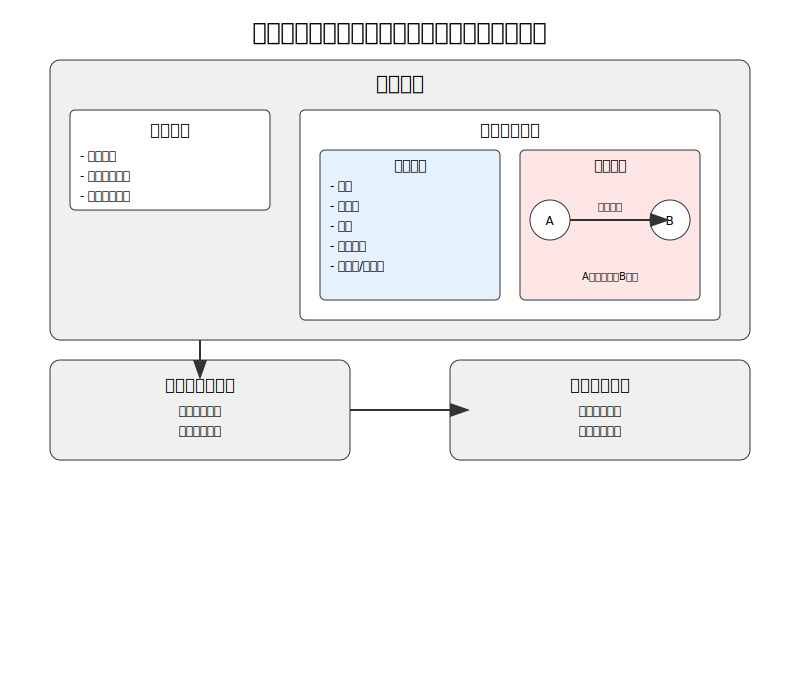

This patent designs a specialized data cleaning tool for LLM in the testing domain. Using a proprietary algorithm, it can efficiently convert raw data into a data format suitable for further training of large models. This tool can more accurately and quickly identify which are functional input areas (functional buttons) and which are information feedback areas (labels, value displays, etc.) compared to the usual manual method. It can also intelligently establish the corresponding linkage relationship between the actions of functional buttons and information feedback areas without human intervention. By just providing an entry point for the software, it can quickly generate training data for the entire software on its own. This greatly improves the efficiency of generating training data for LLM in the testing domain.

## 7.2 A Method to Overcome the Low-Rank Bottleneck in LoRA for LLM in the Testing Domain

Parameter-Efficient Fine-Tuning (PEFT) is a popular model training method that optimizes only a small portion of parameters while keeping the main model frozen for adaptation. PEFT methods can achieve considerable fine-tuning performance with much fewer computational resources compared to full fine-tuning. LoRA is currently the most widely applied PEFT method. It allocates additional low-rank matrices for the backbone model and only optimizes the low-rank matrices during training. Using LoRA can significantly reduce the memory usage required for fine-tuning models, enabling research on fine-tuning LLM with limited computational resources.

Although using the LoRA method can improve efficiency, it is still essentially a Low-Rank Optimization, which still has performance gaps compared to full fine-tuning. In cases where the training data is not complex, the ordinary LoRA method can completely reach a usable level.

However, in the testing domain where training data is relatively scarce, using the original LoRA method is more likely to cause a decline in learning ability. In this patent, to break through the low-rank bottleneck in LoRA optimization and improve performance in the testing domain, we propose an improved training algorithm that accumulates low-rank update matrices multiple times to achieve a higher update rank. The algorithm automatically divides the training into multiple stages internally. In each stage, only the LoRA weights are updated. However, at the end of each stage, the algorithm unloads the LoRA weights into the backbone parameters and then reinitializes the LoRA state.

This approach allows for quick and efficient adjustment of large model weights in situations with limited training data, such as in the testing domain, breaking through the Low-Rank Bottleneck in LoRA and enabling it to handle testing tasks with higher accuracy and efficiency. Compared to traditional large model training methods, this fine-tuning method significantly reduces training costs and can provide more precise model output in the testing domain.

## 7.3 An Efficient Reward Algorithm for Validating LLM in the Testing Domain

In the testing domain, traditional reward mechanisms for large model training are usually based on broad task standards such as accuracy or execution performance, which often fail to fully reflect the complexity and diversity of software testing. The reward algorithm proposed in this patent significantly improves the model's effectiveness and efficiency in software testing through more refined and targeted reward and penalty strategies.

This new method is superior to traditional reward mechanisms for the following reasons:

1. **Highly targeted**: By designing specific reward mechanisms such as correctness rewards, error penalties, exploration rewards, diversity rewards, and efficiency rewards, the model's behavior can be customized according to the actual needs of software testing. This design makes it easier for the model to understand and operate complex user interfaces while encouraging it to cover different paths and functions in testing tasks.

2. **Rapid convergence**: Compared to the generalized reward mechanisms of traditional large models, the reward mechanism proposed in this patent can provide immediate feedback based on the model's specific behaviors (such as correct operations, erroneous operations, etc.), prompting the model to quickly learn and optimize its own strategies. This significantly accelerates the convergence speed during model training, allowing it to achieve high testing efficiency in a short time.

3. **Improving test comprehensiveness and efficiency**: Through diversity rewards, the model is encouraged to explore more operation paths, ensuring the comprehensiveness of test coverage and reducing the risk of missing key test scenarios. Additionally, efficiency rewards further drive the model to optimize the execution speed of operations, greatly improving the efficiency of automated testing while enhancing testing accuracy.

4. **Superior capability to traditional large models**: Although traditional large models perform well in general scenarios, they still struggle to match the insights of human experts in specific domains like software testing. This patented method can gradually optimize the model's performance to a level close to or even surpassing that of junior testers through specialized reward mechanisms, achieving wider coverage and higher accuracy.

In conclusion, this new method focuses on the practical needs of software testing through flexible and diverse reward strategies, not only significantly improving the training efficiency and effectiveness of large models in this field but also equipping them with stronger testing capabilities and flexibility, surpassing traditional generalized training methods.

# 8 KEY PERSONNEL

E2E Testing is crucial for software development, determining whether a software company can deliver a flawless product to its users. However, testing can also be a source of significant risk, as even a small bug can lead to substantial losses for a company. A few years ago, Heng Tian worked at a small startup. The team had the opportunity to preload software onto a new model of mobile phone, and everyone was excited. But the software had to be delivered before the phones were manufactured. With limited resources and a small team, everyone worked relentlessly. In the rush, the software was finally submitted, but only a few days later, the team discovered a critical error. A key feature toggle had not been activated, rendering certain functionalities permanently inaccessible to users. By that time, the software had already been sent to the phone manufacturer and could no longer be altered. The company suffered significant losses due to this oversight. This experience left Heng Tian contemplating whether there was a way to help teams reduce the likelihood of such issues. At the time, there didn’t seem to be a viable solution other than increasing the number of testers. However, with the development of AI technology, new possibilities have emerged. Heng Tian proposed a solution, Cyberbard, that not only makes testing more comprehensive but also reduces manpower costs. Moving forward, Heng Tian aims to work with like-minded individuals to revolutionize the testing industry using artificial intelligence.

<!-- Key Team Members -->

## 8.1 Heng Tian – Founder and CEO

<!-- Founder information, primarily your background, and must align with your resume. Just a brief description will suffice. -->
Heng Tian holds a Master's degree in Engineering Management from Peking University and has over 10 years of core R&D and management experience in the internet and software development sectors. He has led product development teams in both startups and Fortune 500 companies, successfully bringing new products to market. One of the reading applications he spearheaded won a place in China's Top 100 Apps of 2013 and ranked in the Top 10 in the news and reading category. In the enterprise application market, he has extensive experience, having developed enterprise office and instant messaging systems for large publicly listed companies and government agencies, serving over 500,000 corporate employees and government staff, earning widespread industry recognition.

<!-- ## 8.2 KEY ADVISORS

If there are key advisors, they can be listed here. For example: industry expert advisors, technical advisors for non-technical founders, etc. -->

## 8.2 Three-Year Recruitment PLAN

<!-- The three-year recruitment plan should align with the preceding R&D plan. -->

A well-established team structure is crucial to achieving our goals. This section outlines Cyberbard’s recruitment plan for the next three years. The team's structure will evolve at different stages to meet the changing requirements, with the overall aim of efficiently utilizing resources to accomplish the product development and sales goals. The detailed plan is as follows:

- **Year 1: Core Product Development**
  - The primary developer will be the founder, who will be responsible for building the initial technical framework and launching the MVP version.
- **Year 2: Begin Market Expansion and Scale R&D**
  - In Q1 of this year, we will add a part-time Data Compliance Officer to ensure data compliance during engine training and after the product’s commercial launch.
- A Marketing Personnel will be added in Q1 to begin marketing efforts for the product.
  - In Q2, we will add 1-2 technical developers to optimize product features based on user feedback and expand product capabilities.
  - A part-time Office Administrator will be hired to assist with office-related tasks.
- **Year 3: Rapid Market Share Growth**
  - We will add 2 more Sales Personnel to help boost sales and support rapid user growth.
  - Two additional technical specialists will be hired for large-model algorithm optimization to ensure the product keeps pace with the latest technological trends and enhances its core competitiveness.
  - A dedicated Customer Support Specialist will be brought on to gather and address customer inquiries.
  - As the team grows, the part-time Office Administrator will transition to a full-time role to better manage office-related responsibilities.

In summary, over the next three years, the plan is to continuously fill key positions to meet the evolving needs of Cyberbard's future development.

# 9 MARKET RESEARCH

<!-- Market Research
List all market research activities here, such as research on the overall size of the software testing market, the global situation, the UK market status, development trends (including technology and market), etc. -->

## 9.1 Overview of the Software Testing Market

As software applications become increasingly complex and feature-rich, the need for extensive testing to ensure performance, functionality, and security is driving demand for testing solutions and services.

In today’s competitive market, delivering high-quality software with optimal user experience is crucial for customer satisfaction and retention. This is why companies must invest in robust testing methods to identify and fix defects early in the development process. The rise of Agile and DevOps methodologies, which encourage iterative development, continuous integration, and delivery, has also fueled demand for automated testing tools and processes that can speed up release times without compromising quality. However, resource and budget limitations can prevent organizations from investing heavily in testing tools, processes, and skilled personnel, affecting the effectiveness and quality of testing outcomes. The shortage of experienced testing professionals and a lack of understanding of new technologies such as artificial intelligence (AI) and machine learning can pose challenges for businesses looking to adopt cutting-edge testing practices and tools. These factors are contributing to the growing expansion of the software testing market as new needs emerge.

According to market research data from [GMI](https://www.gminsights.com/industry-analysis/software-testing-market), the global software testing market size reached $51.8 billion in 2023, and it is expected to grow at a compound annual growth rate (CAGR) of over 7% between 2024 and 2032. This growth is largely driven by the continual introduction of new products and technological innovations by large companies. In addition, the rapid advancement of technology is putting increasing pressure on companies to deliver superior software solutions to meet evolving user needs. These factors are driving the demand for error-free software, further boosting the need for advanced testing tools and technologies. Specifically, the automated application testing market is projected to exceed $97.3 billion by the end of 2032.

Image source: [GMI Global Market Insights](https://www.gminsights.com/industry-analysis/software-testing-market)

North America is the largest and most developed market for software testing. According to a report by [For Insights Consultancy](https://www.forinsightsconsultancy.com/reports/software-testing-market/), the North American market accounts for 37% of the global market value. Meanwhile, the Asia-Pacific region is experiencing rapid growth due to increasing outsourcing and digitalization trends. The software testing industry in North America has a long history, with many large publicly listed companies and service teams offering a wide range of testing services, including industry giants like Accenture and IBM. In addition to these large companies and testing firms, there are emerging companies focusing on specific testing technologies or industries, such as Selenium and Katalon. These companies are trying to leverage new technologies and more user-friendly services to stand out in this fast-changing and dynamic industry.

Regarding the UK market, according to the [IBISWorld's Software Testing Services in the UK Industry Report](https://www.ibisworld.com/united-kingdom/market-research-reports/software-testing-services-industry/), the market size of the UK software testing services industry is expected to reach £1.2 billion in 2024. Between 2019 and 2024, the industry grew at a compound annual growth rate of 1.6%. There are 662 companies in the UK software testing services industry, with leading players such as Intertek, Keysight Technologies, and DXC Technology. Compared to the diversity of the North American market, the UK’s software testing companies primarily serve large industry clients, with room for further innovation.

## 9.2 Proportion of Small and Medium-Sized Software Enterprises

While large companies play a dominant role in the market and significantly contribute to its prosperity, small and medium-sized enterprises (SMEs) are still an essential and often overlooked part of the market. According to McKinsey's report, “[Beyond financials: Helping SMEs thrive](https://www.mckinsey.com/industries/public-sector/our-insights/beyond-financials-helping-small-and-medium-size-enterprises-thrive),” SMEs account for approximately 99% of all businesses in OECD countries and provide 70% of all employment. They contribute more than 50% of GDP in high-income countries. The report reveals that SMEs contribute more to national wealth than expected, considering their size. According to the [World Bank](https://www.worldbank.org/en/topic/smefinance), SMEs make up about 90% of all businesses globally, providing 50% of employment, and in emerging markets, they contribute up to 40% of GDP.

Similarly, in the global software and services sector, according to research by [Abessoftware IDC](https://bg.qianzhan.com/), SMEs dominate the market. The data shows that micro-enterprises account for 95% of software firms. Specifically, 48.2% of companies have fewer than 10 employees, while 46.8% have between 10 and 99 employees. This data suggests that the software industry is mostly composed of small and micro-enterprises, with low industry concentration. This presents significant market potential to meet their needs.

Image source: [Report of Market Prospective and Investment Strategy Planning on China Software Industry (2024-2029)](https://bg.qianzhan.com/report/detail/4a047030ec144047.html)

## 9.3 Needs and Challenges of SMEs

While the above data seems promising, it masks the difficulties that SMEs must overcome. Small and medium-sized enterprises often face fierce competition, which is increasingly globalized, contributing to their high failure rates. They have limited resources, which means they cannot always establish robust support systems and often cannot invest in technologies that save time and money. In software development, compared to large enterprises, SMEs have relatively limited resources for testing. According to a report by Statista, 25.6% of small companies allocate less than 10% of their staff to testing, and 26.2% of small companies allocate less than 10% of their budget to testing. This indicates that most small companies, due to resource constraints, struggle to allocate sufficient testing personnel, and the automated testing tools on the market are often too complex and expensive for many small teams, leaving them reliant on manual testing.

SME Testing Budget Statistics:

SME Testing Personnel Statistics:

Image source: [Future of Quality Assurance](https://www.lambdatest.com/future-of-quality-assurance-survey)

## 9.4 Opportunities in the Automated Testing Tools Market

As the software testing market continues to expand, SMEs increasingly demand simple, cost-effective, and easy-to-use automated testing tools. Surveys indicate that more than half of respondents view the cost of software testing as one of the biggest challenges businesses face. This suggests a growing market need for intelligent solutions to help SMEs reduce software testing costs while maintaining software quality.

Moreover, concerns about "losses caused by inaccurate test configurations" are rising, further highlighting the need for more intelligent and automated testing tools. SMEs require a more flexible and affordable automated E2E Testing solution to enhance efficiency and quality in the software development process, lower testing costs, and reduce the risk of errors.

## 9.5 Research Conclusion

In summary, the demand for automated E2E Testing tools is increasing significantly, especially in the SME sector. Current market conditions and research data indicate that the software testing market will continue to grow rapidly. However, there is a substantial market gap in providing SMEs with affordable and user-friendly automated E2E Testing tools. Developing such tools will not only help these companies reduce costs and increase efficiency but also promote further growth in the software testing market. Lightweight, easily deployable, and maintainable automated testing tools tailored for SMEs are poised to become a vital part of the market and offer considerable business value.

# 10 COMPETITOR LANDSCAPE

In the market for "E2E Software Testing Platforms," several key competitors stand out. These products cater to companies of various sizes and specialize in different areas. Below is a detailed analysis of these competitors, highlighting their features, market positioning, strengths, and weaknesses.

## Feature Comparison

The table below compares the primary features of the main competitors. Compared to other products, **Cyberbard** focuses on automating E2E Testing, leveraging AI for test case generation, integrating cloud services, and using UI recognition to minimize user effort. Additionally, Cyberbard integrates seamlessly with other testing tools for areas like Unit Testing, where established solutions already exist, through its CI/CD capabilities.

| No. | Tools     | Low Code | AI E2E Testing | Customized Services | CI/CD | Cloud Services | UI Recognition | Unit Testing |
| --- | --------- | -------- | ----------------| --------------------| ------| -------------- | -------------- | ------------ |
| 1   | Intertek  | ❌       | ❌              | ✅                   | ❌    | ❌             | ❌             | ✅           |
| 2   | Keysight  | ✅       | Part              | ✅                   | ❌    | ❌             | ✅             | ❌           |
| 3   | Selenium  | ❌       | ❌              | ❌                   | ✅    | ❌             | ❌             | ✅           |
| 4   | Katalon   | ✅       | Part             | ❌                   | ✅    | ✅             | ❌             | ✅           |
| 5   | Cyberbard | ✅       | ✅              | ❌                   | ✅    | ✅             | ✅             | ❌           |

## Intertek

Intertek is an industry-leading provider of software testing services, with a global presence and expertise. The company offers competitive solutions, covering comprehensive software testing services for websites, desktops, connected homes/vehicles, and mobile devices. Intertek integrates multiple testing techniques to meet varied needs and provides constant updates at every stage of product release. It acts as an extension of clients' QA teams by seamlessly integrating their processes and tools into its testing protocols.

Products include:

- Application Program Testing
- Software and Application Quality Assurance (SQA) Testing
- Cybersecurity Certification and Testing

Founded in 1996, Intertek was spun off by Charterhouse Capital in 2000 and listed on the London Stock Exchange in 2002. With extensive coverage and established client trust, it serves many traditional industry customers.

**Headquarters**: UK  
**Price**: Customized  
**Target Clients**: Large enterprises across various industries  
**Founded**: 1996  
**Publicly Listed**: Yes, LSE (ITRK)  
**Market Share**: 28.86% (based on data from [6sense.com](https://6sense.com))  

**Strengths**: Broad service range and expertise; strong brand influence and client trust; customizable services.  
**Weaknesses**: High cost and complexity, making it unsuitable for small teams or budget-conscious companies. Lacks automation and low-code features that reduce human effort.

## Keysight (Eggplant)

Eggplant is an innovative player in AI-driven testing automation. Founded in 2011, Eggplant provides solutions focusing on functional and usability testing, performance testing, and Robotic Process Automation (RPA). It is particularly suited for well-funded enterprise users, with a price point of $9,999 per team. Recently acquired by Keysight Technologies (NYSE: KEYS), Eggplant has benefited from additional resources and growth opportunities, holding a 3.11% market share.

Products include:

- AI-driven functional and usability testing automation
- Performance testing
- Robotic Process Automation (RPA)
- Performance monitoring

**Headquarters**: UK  
**Price**: $9,999 per team  
**Target Clients**: Well-funded enterprises  
**Founded**: 2011  
**Publicly Listed**: Acquired by a publicly listed company (NYSE: KEYS)  
**Market Share**: 3.21% (based on data from [6sense.com](https://6sense.com))  

**Strengths**: AI capabilities that enhance testing across multiple types; performance testing and RPA functionality; strong support from its parent company, enabling continued innovation.  
**Weaknesses**: Complex user interface and script-heavy design limit the usability of its AI capabilities; high price point restricts accessibility for small and mid-sized businesses.

## Selenium

Selenium is an open-source software testing framework particularly suited for web application testing. Since 2004, Selenium's free and highly customizable nature has made it a popular choice for many companies and developers. It supports cross-browser testing and benefits from an active community and extensive resources. While it holds a market share of 28.86%, comparable to Intertek, it requires advanced technical skills for development and maintenance.

**Headquarters**: USA  
**Price**: Free  
**Target Clients**: Companies with development capabilities  
**Founded**: 2004  
**Publicly Listed**: No  
**Market Share**: 28.86% (based on data from [6sense.com](https://6sense.com))  

**Strengths**: Completely free; strong community support; highly customizable for technically proficient companies; wide adoption and solid market presence.  
**Weaknesses**: Requires a high level of technical knowledge and programming skills; poor ease of use, not suitable for non-technical users; lacks support for low-code/no-code development.

## Katalon

Katalon is an automation testing tool aimed at small to mid-sized teams, particularly those using agile development methodologies. Launched in 2016, Katalon is built on open-source frameworks like Selenium and Appium but offers a user-friendly interface supporting web, API, mobile, and desktop testing. With a price point of $175 per user per month, it is relatively affordable. Katalon also offers a low-code environment, making it ideal for users without a strong technical background. It holds a market share of 7.29%.

**Headquarters**: USA  
**Price**: $175 per user/month  
**Target Clients**: Agile small-to-mid-sized teams  
**Founded**: 2016  
**Publicly Listed**: No  
**Market Share**: 7.33% (based on data from [6sense.com](https://6sense.com))  

**Strengths**: User-friendly, supports low-code development; relatively affordable for small-to-mid-sized enterprises; broad feature coverage.  
**Weaknesses**: Lacks automatic UI recognition for component detection, requiring testers to modify code for some AI features, limiting the practical benefits of its AI functions; high costs for a self-serve tool.

## Competitor Summary

Each of the competitors above has its pros and cons. Intertek and Selenium dominate the market in terms of share, but the former is costly and complex, while the latter, although free, demands significant technical expertise. Eggplant offers innovative AI-driven functionality but has a high price and complexity that limit its appeal to larger enterprises. Katalon appeals to smaller teams with its ease of use and low-code features, but its AI functionalities are limited. Compared to these competitors, **Cyberbard** stands out by enhancing usability through its AI model, providing a more cost-effective integration solution, and potentially gaining an advantage in the market.

# 11 SALES AND MARKETING PLAN

## 11.1 The Sales Plan

For a B2B product, sales are crucial. **Cyberbard's** target market includes small-to-medium software development teams that rely on AI technology to boost efficiency and innovation, as well as those looking to reduce testing costs and accelerate iteration speeds.

**Year 1**: The primary focus will be on product development and validation. By leveraging the founders' connections and small-scale, free promotion within the industry, the aim is to secure 100 interested users, with 10 converting to paying customers to gather feedback and validate the business model. In Q4, a part-time sales rep will be hired to prepare for more extensive outreach.

**Year 2**: Once the product has undergone several iterations and is stable enough for commercialization, the part-time sales role will be converted to full-time. The goal is to achieve over £200,000 in revenue and break even by the year's end, with more than 500 paying customers and an emerging influence in the automated testing sector.

**Year 3**: After gaining market recognition, the company will move into a rapid growth phase, hiring 2-3 additional sales representatives to further penetrate the market. The goal is to grow the paying customer base to 2,000 and generate over £1 million in sales.

## 11.2 Marketing Plan

As a digital platform, Cyberbard's product can serve global customers, and its marketing efforts will also be diversified:

- **Promotions**: Free trial accounts will be offered on forums and at industry conferences where testers are active to attract early adopters.
- **Digital Marketing**: Blogs, forum posts, and case studies showcasing Cyberbard's AI solutions and unique advantages will be used to attract potential online users.
- **Advertising**: Various advertising platforms will be leveraged to generate leads.
- **Direct Marketing**: Email and phone communication with prospects will be used to drive sales.

The marketing budget will be adjusted according to the product’s development stage:

- **Year 1**: Focus on free industry channels and internal forums, with a £1,200 budget for content creation, digital marketing, and participating in industry forums and conferences.
- **Year 2**: As the promotion efforts expand, the marketing budget will increase to £50,000 for ongoing digital marketing efforts, additional industry events, and more marketing content. Direct marketing targeting small and medium software development teams will begin.
- **Year 3**: Substantially increasing marketing efforts, with a budget of £200,000+, utilizing a wide range of channels to broaden customer reach. The focus will be on replicating success stories and expanding market share rapidly.

# 12 LEGAL REQUIREMENTS

Throughout the design, development, and commercial operation of **Cyberbard**, we will strictly adhere to relevant legal regulations and industry standards to ensure compliance with data security and privacy protection. With the increasing importance of data privacy and information security globally, particularly in Europe, laws governing data protection have become increasingly stringent. In the European market, any software product that involves the processing of personal data must comply with the **General Data Protection Regulation (GDPR)**.

To ensure our platform's legal operation, we plan to hire a part-time **Data Compliance Officer** before expanding our product's reach in the second year. This officer will help us handle data and regulatory issues, ensuring the platform remains legally compliant. The following measures will be put in place to address data security and privacy protection:

## 12.1 Data Security and Privacy Protection

1. **GDPR Compliance**: Cyberbard will strictly follow the provisions of the GDPR. During software design and development, priority will be given to user data security and privacy protection. Specific measures include, but are not limited to:
   - **Data Minimization Principle**: Only the minimum amount of data required to fulfill the software's functionalities will be collected and processed, ensuring that no unnecessary data handling occurs.
   - **User Consent and Transparency**: Users will be clearly informed about the types of data collected, the purpose of the data collection, and how the data will be processed. Consent will be obtained before data collection and processing, and a transparent privacy policy will be provided for easy user access.
   - **Data Access Control**: Strict data access control measures will be implemented to ensure that only authorized personnel can access sensitive data. The system will include layered access permissions to prevent unauthorized access and misuse.

2. **Data Encryption**: The software will implement encryption for data transmission and storage, using strong encryption algorithms such as **Advanced Encryption Standard (AES)** to ensure data confidentiality and integrity. Any personal data stored on the server will be encrypted at rest.

3. **Data Protection and Security Architecture**: Our software will adopt a modern security architecture, including but not limited to **firewalls, secure gateways, and multi-factor authentication (MFA)**, to prevent unauthorized access or attacks. Regular security audits and vulnerability scans will be conducted to identify and resolve potential security risks promptly.

4. **Data Processing Agreements (DPA)**: We will enter into strict data processing agreements with all third-party service providers to ensure they comply with GDPR and other relevant legal regulations when processing our user data.

5. **Data Deletion and Portability**: Users will have the right to request the deletion of their personal data or request data portability. The software will support users in exporting and deleting their personal data, ensuring they maintain control over their data.

## 12.2 Legal Compliance

1. **Privacy Policy and User Terms**: We will develop detailed privacy policies and user terms that clearly and transparently inform users about the collection, use, storage, and sharing of data. These policies and terms will be written and enforced in accordance with the GDPR.

2. **Regular Reviews and Updates**: To ensure ongoing compliance with the latest legal regulations and industry standards, we will establish a regular review mechanism. This will involve periodic assessments and updates of all internal policies and procedures related to data privacy and security, allowing us to respond to evolving legal environments and technological challenges.

3. **Employee Training and Awareness**: We will provide regular training for all employees on data protection and privacy, ensuring that all staff understand and comply with the requirements of GDPR and other relevant legal regulations. This will enhance their awareness and capabilities in handling data and ensuring security.

## 12.3 Legal Compliance Summary

We understand that, in addition to offering a high-performing software product, ensuring legal compliance and data security is essential. Therefore, legal compliance will be a core principle in the design and operational management of **Cyberbard**. We will prioritize compliance throughout the development and marketing of our product, ensuring that our software not only delivers excellent functionality but also protects user data to the highest standard. By implementing strict compliance measures and security strategies, we are committed to providing users with a safe, reliable, and compliant automated testing solution.

# 13 SWOT ANALYSIS

## 13.1 Strengths

- **Self-developed AI Model**: Cyberbard’s **CT-LLM large model** focuses on automating **E2E Testing**, offering a unique technological solution tailored to address the pain points of small and medium-sized software companies. This clearly defined use case holds strong commercial potential.
- **Agile Startup Environment**: The company operates with a lean structure and simple decision-making process, allowing for quick product adjustments and the flexibility to adapt to changing market demands.
- **Experienced Founding Team**: The founders have years of experience in software development and testing, which ensures that the technical development is well-guided and the project progresses smoothly.

## 13.2 Weaknesses

- **Limited Brand Awareness**: As a new startup, Cyberbard has low visibility in the market, which may make it difficult to compete with established brands in the short term.
  - **Countermeasure**: Increase exposure through targeted marketing campaigns, such as publishing technical innovation articles in industry media, participating in industry conferences and exhibitions, and expanding the user base through waitlists on the official website and social media platforms.
- **Small Team Size**: The current team is small, particularly in terms of resources for project expansion and market promotion.
  - **Countermeasure**: Implement a phased recruitment plan in line with the current development stage, prioritizing hires in marketing, technical development, and customer support. Additionally, to optimize resource use, consider partnering with external service providers or freelancers for short-term projects or marketing initiatives.

## 13.3 Opportunities

- **Breakthroughs in AI Technology**: As industry recognition of large language models (LLMs) increases, new algorithms and models are emerging. Capabilities that were once difficult to achieve are now more feasible to develop and bring to market.
- **Growing Demand for AI Solutions**: With increasing acceptance of AI across industries, the demand for leveraging AI to further enhance the automation of software testing is also growing, providing Cyberbard with significant opportunities for market expansion.

## 13.4 Threats

- **Rapid Technological Advancements**: The AI and software testing tool markets evolve quickly, and existing solutions may face the risk of becoming outdated, requiring ongoing investment in R&D to maintain a technological edge.
  - **Countermeasure**: Ensure continuous investment in R&D to stay updated on the latest technology trends, regularly updating and optimizing the **CT-LLM model**. Additionally, maintain connections with the open-source community to leverage existing open-source resources and accelerate technological updates.
- **Intense Competition**: The market is competitive, with both AI startups and large tech companies potentially posing threats by leveraging more resources and their existing market share.
  - **Countermeasure**: Maintain a competitive edge through differentiation strategies, such as focusing on the specific needs of small and medium-sized enterprises and offering cost-effective solutions. Continue to optimize the proprietary **CT-LLM model** by enriching industry-specific datasets and training new models to ensure a technological advantage.

# 14 Business Milestones for the Next Three Years

1. **Year One**
   - Complete the development of the **MVP (Minimum Viable Product)**.
   - Establish basic operational processes; at this stage, development will primarily be carried out by the founders.
   - Invite industry professionals for trials and acquire 5-10 paying users, gathering feedback through real projects.

2. **Year Two**
   - Continuously improve the product based on customer feedback to achieve a stable and reliable commercialization capacity. Simultaneously, initiate market promotion and operations.
   - Increase the team size to 4-5 members.
   - Grow the customer base to over **600 paying users**.
   - Achieve revenue of over **£200,000**.

3. **Year Three**
   - Achieve solid **product-market fit**, utilizing various channels to expand product exposure to target customers, rapidly increasing user numbers and total revenue.
   - Expand the team to **10 members**.
   - Grow the business to nearly **2,000 paying users**.
   - Achieve revenue of over **£1,000,000**.

# 15 ENDORSEMENT CRITERIA SUMMARY

## Innovation

Cyberbard has developed its proprietary AI model, **CT-LLM**, specifically designed for the software testing industry, significantly enhancing the automation process. Unlike traditional testing tools, Cyberbard's platform can generate test cases and scripts from natural language descriptions and automatically update them as product changes occur. This reduces the workload for testers and eliminates the dependency on manual script writing, fundamentally transforming the testing process for small and medium-sized software companies. This innovation boosts both the speed and quality of product iterations.

## Feasibility

Cyberbard has a clear technical and market development roadmap. The company plans to complete the initial training of CT-LLM within six months and release an **MVP (Minimum Viable Product)** within a year to serve its first batch of users. Based on current market feedback and preliminary contract agreements, Cyberbard’s solution has undergone initial market validation and demonstrates potential for achieving key milestones. Additionally, leveraging open-source tools as a technical foundation ensures that Cyberbard can deliver a functional product within a shorter development cycle, progressing steadily within budget.

## Scalability

Cyberbard’s platform not only addresses the **E2E Testing** resource bottlenecks faced by small and medium-sized software companies, but its AI-driven solution also offers significant scalability potential. As CT-LLM evolves, the system will be able to support a wider range of platforms, application scenarios, and serve companies of various sizes and industries. Over time, the capabilities of the AI model will continue to improve, allowing Cyberbard to reach a broader customer base and achieve wider market penetration.

# 16 INVESTMENT INFORMATION

In this business plan, **Heng Tian**, the founder, plans to invest £150,000 in cash, with funds sourced from personal savings. Before achieving profitability in the second year, this initial investment will primarily cover various expenses. The funding will be allocated to the following areas:

- **R&D Budget**: All research and development-related expenses will fall under this category. It will be used to pay the salaries of software developers, cover the costs of research and optimization of AI algorithms, and handle the design and implementation of testing tools. The R&D phase will be the focus of the first investment cycle (Year 1), with most of the funds allocated to pay the salaries of developers. Additional costs will include software licenses, AI compute costs, and the expenses related to training the CT-LLM model, such as fees for the collection and licensing of training data.
- **Total Wages**: This includes the salaries and bonuses of newly recruited employees (non-R&D personnel) and covers National Insurance Contributions (NICs) and Workplace Pension Contributions.
- **Marketing**: Funds for market research, brand promotion, and the development and implementation of marketing strategies prior to product launch.
- **Office Rent**: Costs for shared office spaces and meeting rooms.
- **Accounting Fees**: Costs related to accounting services.
- **Miscellaneous**: This includes general operating expenses such as leasing office supplies and other day-to-day operational costs.

## 16.1 USE OF INITIAL INVESTMENT FUNDS

The first year is critical for the company, especially as a startup, where efficient allocation of limited resources is essential to build and launch the product. The primary focus of the investment will be on R&D to ensure the product is brought to market as soon as possible, while keeping daily operational, office, and other non-essential costs to a minimum. The breakdown of first-year expenses is as follows:

1. **R&D Budget**: Totaling £69,000, including:
   - The founder, as the initial software developer, will receive a basic salary: £23,000
   - Costs associated with training the CT-LLM model, including data acquisition, data processing, compliance, and compute resources: £46,000
2. **Cost of Goods Sold (COGS)**:
   - Operational costs related to running CT-LLM services (e.g., cloud services, daily compute usage): £1,200
   - Since the user base will be small in the first year, this expense is minimal and expected to increase as user numbers grow in the following two years.
3. **Total Wages**:
   - This item includes the total salaries for non-R&D staff. In the fourth quarter of the first year, a part-time marketing staff member will be hired to prepare for product promotion: £8,094
4. **Marketing**:
   - Focus on small-scale promotion through industry forums and the production of social media articles. Estimated cost: approximately £1,200
5. **Office Rent**:
   - There will be no additional employees in the first year, and the founder will work from home to save costs. No office rent is required in the first year. Starting in the second year, with more employees, shared office space will be rented at approximately £1,200 per person annually.
6. **Accounting Fees**:
   - Basic accounting support costs: £1,200
7. **Miscellaneous**:
   - Company registration costs, office supplies, legal and compliance-related services, and other operational expenses. The plan is to keep only essential expenditures, with an estimated budget of approximately £2,350.

# 17 PROFIT AND LOSS SUMMARY

Cyberbard LTD is an innovative, service-based startup. The table below presents profit estimates for the next three years, starting from Year 1. The company is expected to achieve rapid growth during the three-year period from initial operations in Year 1 through to Year 3. Our financial projections show a typical high-growth trajectory, transitioning from initial investment to profitability, followed by significant revenue expansion.

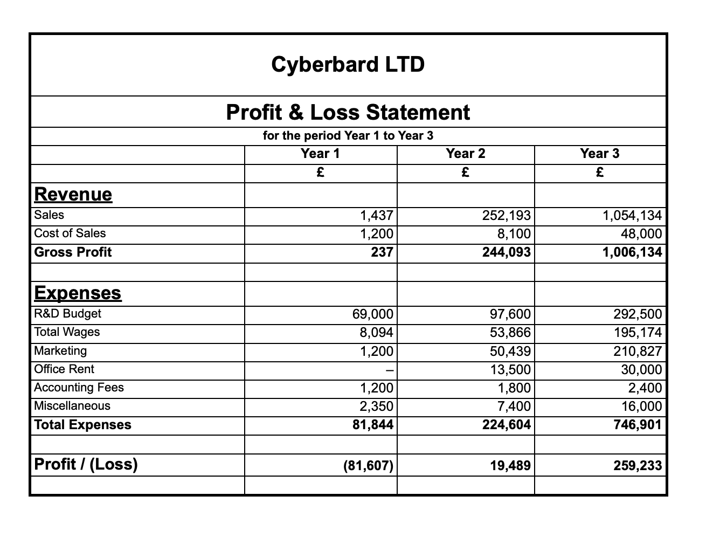

Financial Forecast:

1. **Revenue Growth**:
   - **Year 1**: £237
   - **Year 2**: £244,093
   - **Year 3**: £1,006,134
   - Our service model demonstrates exponential revenue growth, with projections of exceeding £1 million by Year 3.

2. **Cost Structure**:
   Key investments include:
   - **R&D**: Significant investment in research and development, peaking at £292,500 by Year 3.
   - **Sales and Marketing**: With increasing focus, marketing expenditure will grow to £210,827 by Year 3.
   - **Human Capital**: In Year 1, the founder will primarily handle operations, with developer salaries included in R&D costs. From Year 2 onwards, full-time marketing personnel and part-time office staff will be recruited, expanding the team to 10 members by Year 3, including additional technical and sales staff.
   - **Infrastructure**: Most office equipment will be rented or shared, keeping this category a relatively small portion of overall expenses.

3. **Path to Profitability**:
   - **Year 1**: This year will primarily focus on initial investments.
   - **Year 2**: We project a profit of £19,489, breaking even and achieving early profitability.
   - **Year 3**: Profits are expected to soar to £259,233, reflecting a significant improvement in overall profitability.

Our financial strategy emphasizes heavy investment in R&D and infrastructure during the early stages, followed by aggressive market expansion. The substantial increase in advertising and sales-related expenses during Years 2 and 3 reflects our commitment to rapid market penetration and customer acquisition. While losses are expected in Year 1, our forecasts show a swift turnaround to profitability, with exponential revenue growth. This fast-paced expansion presents both opportunities and challenges in managing scaling. Our financial forecast highlights a bold growth vision, and through strategic investments in technology and market expansion, we are confident in our ability to transform Cyberbard from an emerging startup to a high-growth, profitable company within three years. Our focus on service-based revenue and scalable operations positions us for sustainable, long-term success in our target market.

# 18 BALANCE SHEET FORECAST (3 YEARS)

The balance sheet forecast for Cyberbard LTD outlines the company’s financial standing from Year 1 through Year 3. This balance sheet provides a snapshot of the company’s assets, liabilities, and shareholders’ equity. We aim to maintain a lean financial strategy, ensuring long-term sustainability and growth. The forecast shows stable revenue generation and healthy retained earnings growth over the next three years.

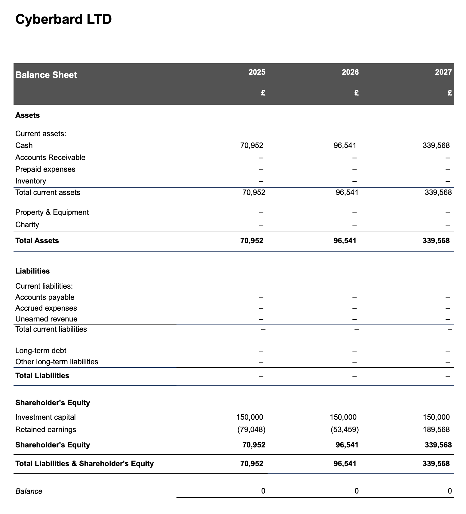

Assets:

- By the end of **Year 1**, Cyberbard is projected to have £68,393 in cash.
- This cash balance grows significantly to **£87,882 by Year 2** and reaches **£347,115 by Year 3**. This increase reflects our ability to generate revenue from operations while managing expenses effectively.
- No other current or long-term assets, such as real estate, equipment, or inventory, are included in this balance sheet at this early stage. This indicates that we will adopt a lean, capital-efficient model focused on managing liquidity and minimizing asset overhead.

Liabilities:

- The balance sheets for all three forecasted years show **no liabilities** (no accounts payable, accrued expenses, or long-term debt). This demonstrates our intention to maintain a debt-free structure, relying entirely on shareholder investment and retained earnings to fund operations.

Shareholders’ Equity:

- The company begins in **Year 1** with **£150,000 in investment capital**, and there are no plans for additional financing during the first three years. This investment represents the initial capital injected by the founder.
- **Retained earnings** start in negative territory, beginning at **-£81,607 in Year 1**, but as operations stabilize and profits grow, the deficit decreases to **-£62,118 in Year 2**. By **Year 3**, retained earnings turn positive, reaching **£197,115**. This positive trajectory highlights our ability to achieve profitability over time and build reserves for future growth.

Overall, Cyberbard’s forecasted balance sheet reflects a well-managed financial plan that leverages initial capital, avoids debt, and steadily builds financial strength through operating success and effective resource management.

# 19 YEAR 1 CASHFLOW FORECAST

This section analyzes Cyberbard's cash flow statement, providing a detailed overview of the company's financial health and growth trajectory from Year 1 through Year 3. For Year 1, cash flow is broken down quarterly, while for Years 2 and 3, it is reported on an annual basis. The analysis shows that Cyberbard maintains a cash surplus each quarter, ensuring that operational expenses are covered for at least the next three months. Starting from Year 2, the cash flow forecast moves to an annual basis as revenue grows.

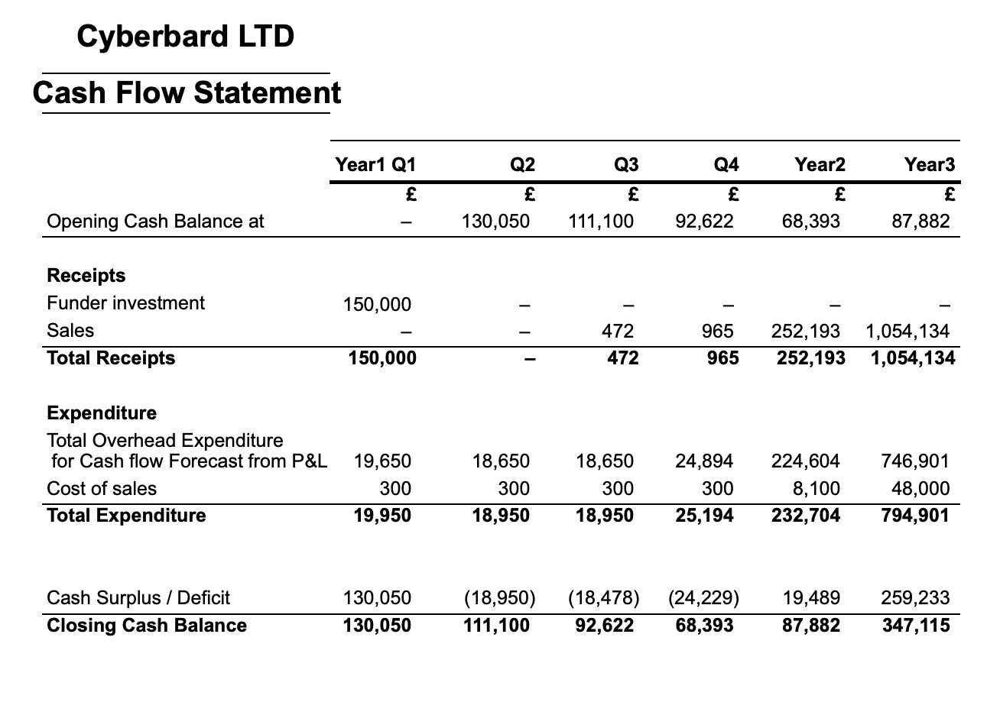

Initial Funding and Early Operations (Year 1):

- In **Q1 of Year 1**, the founder injects an initial capital of **£150,000**.
- Operational expenses initially exceed revenues, resulting in negative cash flow from operating activities.
- Despite these initial losses, the company’s cash balance remains positive throughout Year 1, thanks to the founder’s capital injection.

Growth Phase (Year 2 - Year 3):

- Sales revenue steadily increases from **£472 in Q3 of Year 1** to **£1,054,134 by Year 3**.
- Operational expenses also rise as the company invests in capacity and market expansion.
- In **Q3 of Year 2**, operating cash flow turns positive, marking the beginning of sustainable operations.

Key Financial Metrics:

- **Revenue Growth**: After the completion of Year 1's R&D phase, revenues begin to scale rapidly over the next two years.
- **Operational Efficiency**: The ratio of revenue to expenses improves gradually, showing that the same level of expenditure can support a growing number of customers.
- **Cash Balance**: The cash balance grows from **£126,913 in Q1 of Year 1** to **£374,509 by the end of Year 3**.

Cash Flow Analysis:

- The primary driver of cash flow improvement is **strong organic growth**.
- Cyberbard focuses on **scalable operations** rather than capital-intensive investments, so there is no need for additional capital infusion.
- As the sales plan progresses, the company's improving cash position provides a cushion for further growth initiatives or potential market uncertainties.

In summary, the cash flow projection demonstrates Cyberbard’s trajectory over the next three years: relying initially on founder investment, followed by potential losses during the product development phase, and finally transitioning to rapid revenue growth and profitability. The company’s ability to scale its operations while maintaining and increasing cash reserves reflects a strong business model and efficient financial management. This places Cyberbard in a favorable position for continued expansion and the potential to become a market leader in the coming years.

<!-- - Appendix 1

- Appendix 2

同上 -->
